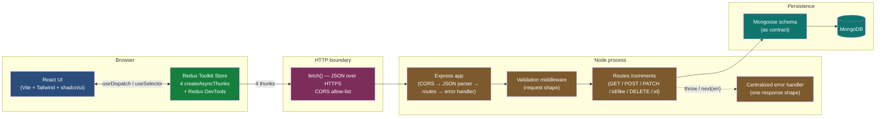

# ai-fullstack-patterns

A working lab for the patterns behind shipping AI-enabled web applications.

The goal is to build up the full toolkit needed to ship a production AI-enabled web app. Each project is a self-contained, runnable workspace paired with a doc that explains the *why* alongside the *what*.

## Why "ai-fullstack" and not just "fullstack"

The "ai" in the name signals a lens, not just a topic. Modern production applications are no longer just full-stack - they are AI-enabled by design. The architectural questions worth thinking about are no longer just "how do you wire frontend to backend?" but "how do you build state coordination, data fetching, async orchestration, and component composition in a way that accommodates AI integration cleanly?" LLM streaming, agent orchestration, vector retrieval, prompt-assembled UI, long-running async AI work, observability of agent traces - these are new pieces every serious web app now has to make room for.

Each project in this repo is chosen because it matters for AI-enabled production software. **Redux Toolkit** (the first project) is here as the pattern for coordinating complex client-side state - chat UIs, optimistic AI-generated content, agent observability dashboards. Future projects cover **Next.js Server Components** for server-side AI work (RAG queries, LLM calls, prompt assembly), **FastAPI sidecars** for the Python ML ecosystem (PyTorch, transformers, embeddings), **Claude Agent SDK** for agentic workflows, and **Vercel AI SDK** for token streaming - the actual production stack for AI-enabled software in 2026.

The patterns will extend beyond Redux and React over time. The lens applies wherever you build production software: future projects may cover Angular, MEAN-style stacks, Java Spring Boot backends, and mobile (React Native and native). The unifying thread is the same question: **how do you build production-grade software that is AI-enabled by design, rather than retrofitted as an afterthought?**

This is the patterns workspace I draw from for my own client work, including **CSI (a production diagnostic system)** — an AI-native operations and diagnostic platform I am building. The shift itself is the real thing: full-stack development today increasingly means AI-enabled full-stack, where one engineer with AI assistance can hold every layer that used to require a team — but only with the architectural judgment to make AI acceleration actually work in production.

## Architecture at a glance

The currently-built projects compose into one end-to-end full-stack system. The React app and the Express backend are independently runnable; together they demonstrate the integration patterns that the docs explain.



Five layers, one HTTP boundary. The interesting bugs almost always live at the boundary; the architecture above is designed so the boundary is the *narrowest* possible thing — one request shape in, one response shape out.

## The journey

A suggested progression through the projects. Each one introduces a layer that the next builds on, but folders are named by topic rather than by index, so projects can be added or rearranged without renumbering.

| Project | Status | What it covers |
|---|---|---|
| [`projects/redux-plain-js/`](./projects/redux-plain-js/) | Built | Redux Toolkit in plain JavaScript, no React. `configureStore`, `createSlice`, `createAsyncThunk`, `dispatch`, `subscribe`, `getState`. Console-driven. Proves Redux is framework-agnostic. |
| [`projects/react-redux/`](./projects/react-redux/) | Built | The same store wired into a React UI with `useDispatch`, `useSelector`, and `<Provider>`. Four `createAsyncThunk`s wired to a real backend, with optimistic and pessimistic update patterns. Redux DevTools time-travel. |
| [`projects/express-comments-api/`](./projects/express-comments-api/) | Built | Node + Express + Mongoose backend for the comments app. Ordered middleware, layered validation, centralized error handler, schema as contract, CORS as security boundary. Pairs with [`docs/express-backend.md`](./docs/express-backend.md) and [`docs/full-stack-integration.md`](./docs/full-stack-integration.md). |
| `projects/nextjs-app-router/` | Planned | Next.js 14+ App Router fundamentals: routes, layouts, loading states. The baseline for the Next.js projects below. |
| `projects/react-server-components/` | Planned | React Server Components + Server Actions. Where the modern stack starts to leave traditional Redux behind for server-owned state. |
| `projects/tanstack-query/` | Planned | TanStack Query for server data, what most modern production stacks use instead of `createAsyncThunk` for fetching. |
| `projects/fastapi-python-sidecar/` | Planned | FastAPI service for Python ML/AI work. The "split-stack" pattern: TypeScript web plus a Python ML sidecar. |
| `projects/nextjs-fastapi-integration/` | Planned | Full-stack integration. Next.js calling a FastAPI sidecar for AI work, results flowing back through Server Components and Server Actions. |
| `projects/claude-agent-sdk-streaming/` | Planned | Agentic AI in production. Claude Agent SDK with token streaming. |

## What's in this repo (top level)

```
ai-fullstack-patterns/
├── README.md
├── docs/             ← topic docs that pair with the projects
└── projects/         ← runnable code, one folder per topic
```

## How to run any project

**Prerequisites:** Node.js 22 or later. The repo includes an `.nvmrc` file - if you use [nvm](https://github.com/nvm-sh/nvm), running `nvm use` in the repo root will switch to the recommended version automatically.

```bash
cd projects/<project-name>
npm install
npm run dev
```

Each project has its own README with what to look at and what the demo proves.

## How to read the docs

The `docs/` folder contains topic documents in plain Markdown. They render correctly on GitHub (including the inline architecture diagrams) and in any modern Markdown viewer.

| Doc | What it covers |
|---|---|
| [`docs/react.md`](./docs/react.md) | The React mental model itself — render vs commit vs paint, reference equality, `useEffect` (and its banned uses), where state lives, the Provider pattern, Strict Mode, custom hooks. Evergreen foundation for every project in the repo that uses React. |
| [`docs/redux-toolkit.md`](./docs/redux-toolkit.md) | Redux Toolkit through a debugging-experience lens. Why coordination problems are not solvable by inspection, and how RTK shapes the answer. |
| [`docs/express-backend.md`](./docs/express-backend.md) | Production Express patterns — middleware order, async error propagation, centralized error handler, layered validation, CORS as security boundary, the request lifecycle. |
| [`docs/full-stack-integration.md`](./docs/full-stack-integration.md) | The seam between Redux and Express. Where state lives, the four lifecycles, optimistic vs pessimistic updates, rollback mechanics, when this pattern starts to creak. |

The docs are designed to read independently — pick the one that maps to the question you have — but they also flow in the order above as a coherent fullstack story.

## Conventions

- **JavaScript first, TypeScript later.** The early projects use plain JavaScript to keep the code visually clean. Later projects introduce TypeScript alongside Next.js.
- **One concept per project.** Each project introduces one major new idea; earlier projects do not get retroactively modified.
- **Production patterns, not tutorial patterns.** Code reflects what you would actually ship, not the simplest possible thing that runs.
- **No frameworks of frameworks.** No CRA, no Next.js boilerplate generators beyond `create-next-app`. Vite plus raw React, then Vite plus Next.js when we get there.

## License

MIT.
