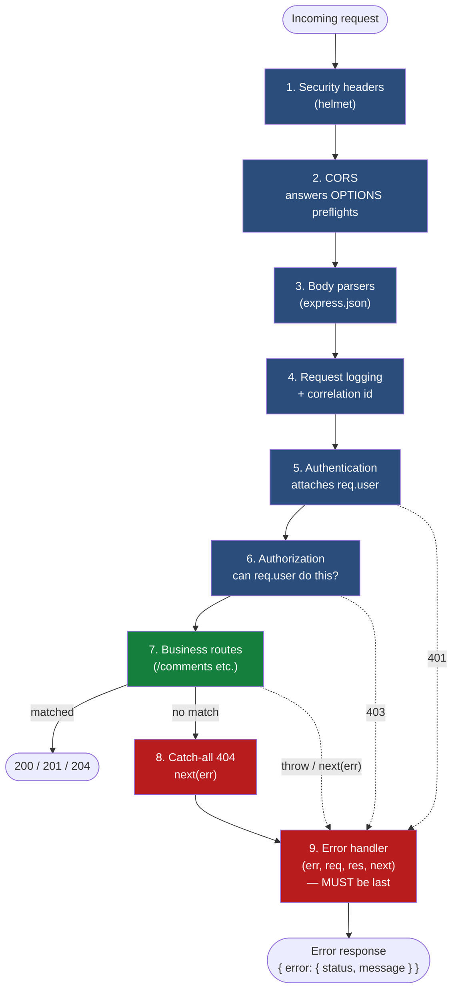
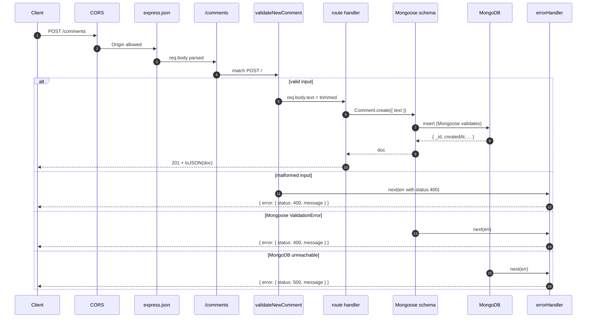

# Express backend — production patterns

> Companion doc to the [`express-comments-api`](../projects/express-comments-api/) project. The code is the artifact; this doc is the *why*. If you skim only one section, skim **Middleware order** — it is the single biggest source of the bugs that look like features.

This doc is not a tour of the Express API surface. It is the set of decisions you should be able to defend when someone asks why your backend is shaped the way it is. The framing is production-shaped, not tutorial-shaped: every section below maps to a specific class of bug, security incident, or 2am outage you do not want to find yourself debugging.

## Why a separate Express service at all?

Two reasonable alternatives exist, both worth knowing:

| Option | Where backend logic lives | When to pick it |
|---|---|---|
| **Standalone Express service** (this project) | Its own repo / container, talks HTTP | Multiple clients (web, mobile, partner integrations); independent deploy cadence; team boundaries; team comfort with Node ops |
| **Next.js Route Handlers + Server Actions** | Inside the Next.js app | Single web frontend; small team; you want one deploy artifact, not two |
| **API gateway + functions** (AWS API Gateway + Lambda) | Cloud-managed; no long-running process | Bursty load; want zero ops between deploys; pay-per-call cost shape |

Standalone Express still wins when the backend is a *product* with multiple consumers, when you want to scale the API independently of the UI, or when the operations team's expertise is Node-shaped. It loses when there is exactly one client (a Next.js app), where Server Components and Server Actions absorb most of the boundary friction.

The standalone-Express pattern earns its place when it forces a clear HTTP boundary between client and server. Most production-grade intuition about that boundary comes from working it directly. Codebases that start with Next.js Route Handlers can paper over the boundary entirely, with the side effect that engineers hit a real wall the first time the production shape demands a separate backend service.

## Middleware order

Express runs middleware top-to-bottom on every request. Get the order wrong and the bug presents as something else entirely. The standard order:



Three common mistakes and the bug each one produces:

**CORS placed after the routes.** The browser's preflight `OPTIONS` request hits the route table, finds no matching handler, returns 404. The browser blocks the actual request before your route handler ever runs. You will spend hours adding `console.log` to a handler that is never invoked.

**Body parser placed after the route.** `req.body` is `undefined` inside the route. You will read `req.body.text`, get `Cannot read properties of undefined`, and assume the client sent a malformed payload — when in fact the client is fine and your middleware order is wrong.

**Error handler placed before the routes.** Express never calls it. The error-handling middleware is detected by Express purely by its four-argument signature `(err, req, res, next)` — if a route throws after this point, Express has no error handler registered for that error and the default handler runs, returning an HTML error page (in dev) or hanging the request (in some configs).

The pattern that has saved me from this class of bug repeatedly: write the middleware order down as a comment at the top of your server file, before you write the `app.use` calls. The order becomes a contract you defend against, not something that emerges from the order you happened to type things in.

## Async error propagation

Express 4 had a sharp edge: an `async` route handler that throws does not automatically pass the error to `next()`. The error becomes an unhandled promise rejection, the request hangs, the client times out. The fix is one of:

1. **Explicit try/catch in every handler.** Tedious but always correct. The code in this project uses this pattern because it is the most explicit — and the easiest to step through when the request path through middleware matters.
2. **`express-async-errors` shim.** Patches Express so async errors automatically propagate. One `import` at the top of `server.js` and you can drop the try/catch boilerplate.
3. **Express 5** (released after years of beta). Native async error propagation.
4. **Wrap each handler in an `asyncHandler` helper** that does the try/catch for you. Common pattern in older codebases.

Pick one and apply it consistently. The bug class — silent request hang on an async error — is the kind of thing that looks like a network issue and gets diagnosed last.

## Centralized error handler

One handler in `middleware/errorHandler.js` shapes every error response. Three reasons this matters more than it sounds like it should:

**Consistency for the client.** The Redux thunk's `rejected` case doesn't care if the error came from validation middleware, Mongoose, or the route handler — it just needs to read `body.error.message`. One handler, one shape, one client-side parser.

**One place to add cross-cutting concerns.** Logging, error tracking (Sentry), redaction of stack traces in production, request-id correlation — add it once, every error benefits. Without a central handler, you end up scattering this logic and missing routes.

**Routes stay focused on the happy path.** A route handler that has to `try / catch / format / send` for every error is mostly error-formatting code. With a central handler, the route reads as "do the work; if anything goes wrong, throw; the platform handles the rest."

The handler in this project distinguishes four cases:

- `err.status` was set explicitly upstream → trust it (404 from the catch-all; 400 from validation)
- Mongoose `ValidationError` → 400 (the request was shaped wrong)
- Mongoose `CastError` → 400 (the request referenced something with the wrong type, e.g. bad ObjectId)
- Anything else → 500 (unexpected; do not leak details)

The 500 case logs the full stack server-side but only the generic message goes to the client. Never leak internal stack traces or query strings to the client in a production error response — they are reconnaissance for an attacker.

## Validation layered, not centralized

Validation runs at two boundaries, deliberately:

| Layer | What it catches | Why |
|---|---|---|
| **Request middleware** (`middleware/validate.js`) | Malformed input from the client | Fail fast, fail specific. The client gets a precise 400 before any database I/O happens. |
| **Mongoose schema** (`models/Comment.js`) | Anything that somehow reached the model layer | Defense in depth. Even if a route somehow skips middleware, the schema is the last gate. |

This is not redundant. It is layered defense. The request validator gives the user a clean error message; the schema validator guarantees the database invariant. Both exist deliberately, and the second one is the reason your DBA does not have an angry conversation with you next month about half-shaped documents in the collection.

At small scale, hand-rolled validators (three small functions in `validate.js`) are clearer than a validation library. The moment you have nested objects, conditional fields, or shapes reused across multiple endpoints, switch to **zod** and put the schemas next to the model. Two reasons zod wins at that scale: type inference (one schema generates the TypeScript type) and composability (you can build complex schemas from simple ones).

## Schema as contract

A Mongoose schema is not just "persistence config." It is the **contract** for what a `Comment` is — the single source of truth that the API, the database, and (eventually) the type system all agree on.

The schema for `Comment` in this project says:

- `text` is required, trimmed, 1 to 280 characters
- `likes` is a non-negative integer, defaulting to 0
- Documents have `createdAt` and `updatedAt`, set automatically
- The client-facing JSON uses `id` (string) instead of `_id` (ObjectId), and never exposes `__v`

That entire shape lives in one file. The route handler does not have to know any of it; it just calls `Comment.create()` and the contract is enforced. The validation middleware does not have to duplicate any of it; it just catches the easy-to-name input errors before the contract is invoked.

When the requirements change — say, `likes` becomes a list of user ids instead of a count — there is exactly one place to change. Every route, every test, every type definition flows from that one change. This is the architecture-grade upside of treating the schema as the contract.

## CORS as a security boundary

CORS is not a "make it work" flag. It is the browser's enforcement of the same-origin policy, and your job on the server is to declare which origins are trusted.

Two patterns that look the same but mean wildly different things:

```js
cors({ origin: true })      // reflects whatever Origin the request claims
cors({ origin: "*" })       // allows any origin, no credentials
cors({ origin: allowList }) // only the origins you listed
```

The first two are appropriate for genuinely public APIs (think: a CDN-cached JSON feed). The third is what production services that do anything authenticated use. The allow-list comes from configuration, not code, so the same code can ship to dev / staging / production with different policies.

A CORS rule of thumb: if your API requires auth (cookies, Authorization header, anything stateful), you cannot use `*`. The browser refuses to send credentials to an unbounded wildcard. The error message — `The value of the Access-Control-Allow-Origin header in the response must not be the wildcard '*' when the request's credentials mode is 'include'` — is one of the most-Googled CORS messages in existence. The fix is always the same: allow-list the specific origins.

## The request lifecycle

A single successful `POST /comments` walks through every layer, and any failure at any layer ends up in the same error handler:



If anything throws or rejects at any stage, control jumps directly to the error handler with the original error. That is the contract that lets every handler above be small.

## What this project is NOT showing yet (and where to go next)

The express-comments-api project is deliberately scoped to one resource and no auth. Production realities you will need to add before shipping to anything resembling a real user:

- **Authentication.** JWT or session cookies. The integration shape is the same in either case: an `auth` middleware that runs after the body parser and before the routes, attaching `req.user` if the token is valid and 401-ing if not. The protected routes then read `req.user` and never re-validate the token themselves.
- **Rate limiting.** `express-rate-limit` or an API-gateway-level limit. Public POST endpoints without rate limits get found in days.
- **Request logging with correlation ids.** Generate a UUID per request, attach it to `req`, log it on every line, return it in the response header. When something goes wrong, you can `grep` the logs by the correlation id the client saw.
- **Pagination.** `GET /comments` returns the whole collection. Fine at ten rows; cripples the server at ten thousand. Cursor-based pagination is the production answer.
- **Concurrency safety on the `like` increment.** This project uses `$inc`, which is atomic at the MongoDB layer. Two concurrent likes never race. The pattern is worth noting because the naive `findById → update field → save` does have the race condition.
- **Graceful shutdown.** On `SIGTERM` (container stop), stop accepting new connections, finish in-flight requests, close the Mongoose connection. The current project just exits — fine for dev, not fine for production rolling deploys.
- **Tests.** Vitest + Supertest is the conventional pairing. Tests would live next to the routes and exercise the full middleware chain.

The [`nextjs-app-router`](../projects/nextjs-app-router/) project (planned) will reshape this same surface using Next.js Route Handlers and Server Actions, and the comparison will show what Express still does well, what Next.js absorbs cleanly, and where the architecture decision actually lives.
