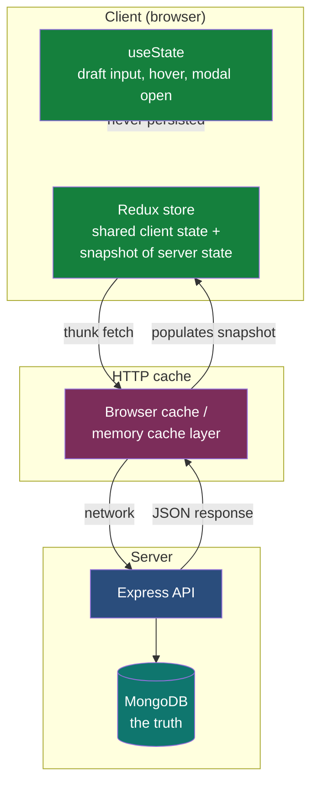
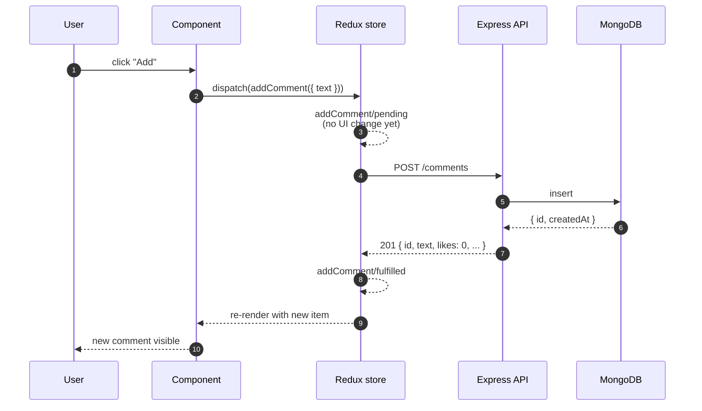
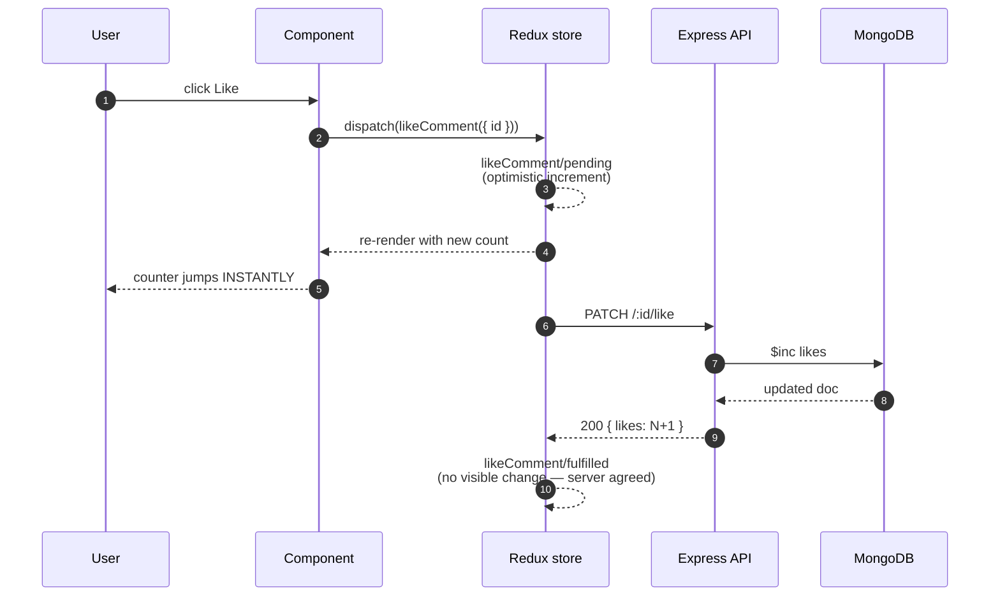
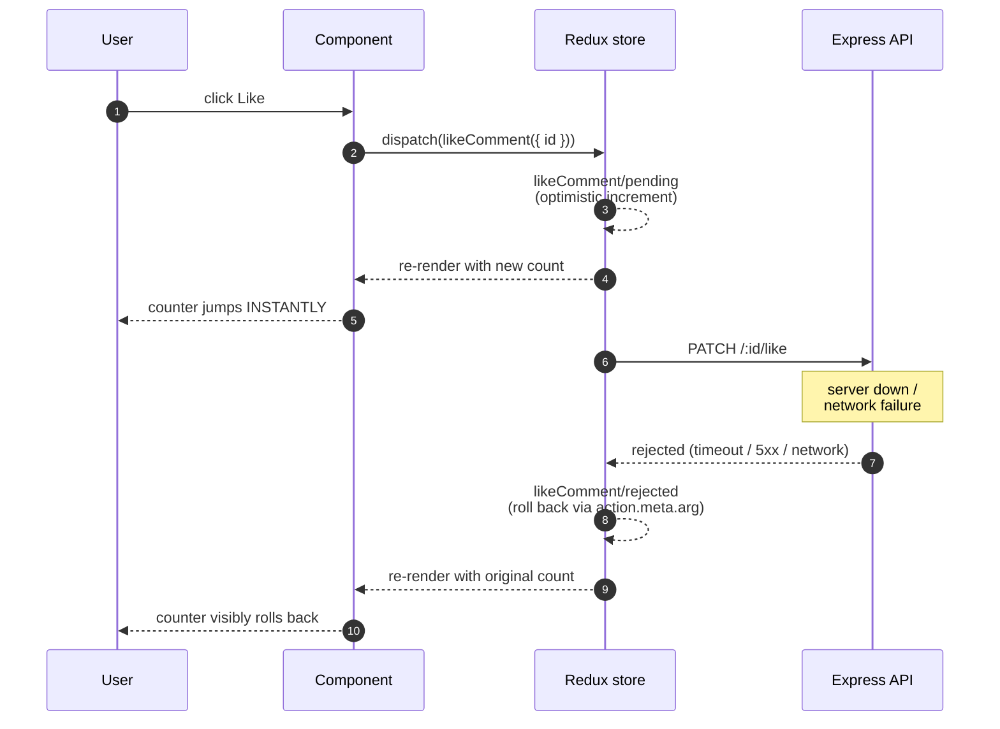

# Full-stack integration — Redux Toolkit ↔ Express

> Companion doc to the [`react-redux`](../projects/react-redux/) and [`express-comments-api`](../projects/express-comments-api/) projects. The first project shows how Redux coordinates client state; the second shows what a production-shaped Express service looks like. This doc covers the seam between them — the layer where most production bugs in this architecture live.

The seam between a Redux client and an Express server is where most "but it works on my machine" bugs are born. Not because either side is wrong individually, but because the developer's mental model treats client state and server state as if they were the same thing.

This doc is about getting that mental model right.

## Where does state live?

Before any code, the diagnostic question. For any piece of information your app needs, there are three places it can live:



| Where | What lives here | Authority |
|---|---|---|
| **Client (Redux store)** | UI-derived state, in-flight values, optimistic guesses, what the user has typed | Replaceable on reload |
| **Server (database via API)** | Persistent business facts — comments, accounts, orders | The truth |
| **HTTP cache / browser** | A snapshot of server state, taken at some point in the past | Stale until proven fresh |

The most common bug in full-stack apps is treating the client store as if it were the source of truth, then being surprised when "the data is wrong" — because the database has moved on and the client never knew.

The discipline:

- **If the user typed it and you have not sent it yet → it lives in Redux.**
- **If the server has persisted it → it lives on the server. The client holds a snapshot.**
- **If the snapshot is older than `n` seconds and the value matters → re-fetch.**

Most state-management debates collapse once you name where each piece of state actually lives. The Redux store is *not* a place to put server state; it is a place to put *the client's current understanding* of server state, plus everything purely client-side. The distinction sounds pedantic until the first time you have two browser tabs open and one of them shows stale data.

## The `createAsyncThunk` lifecycle, now over a real network

In the standalone Redux project, `fetchComments` hit a mock endpoint. The lifecycle was theoretical:

```
comments/fetchComments/pending   ─ optimistic, before the result
comments/fetchComments/fulfilled ─ the success case
comments/fetchComments/rejected  ─ the failure case
```

Once a real network is involved, those three actions take on production meaning:

| Action | What it actually represents | What the UI should show |
|---|---|---|
| `pending` | A request is on the wire. The user might wait. Might never finish. | Loading state, maybe a spinner, maybe nothing if it's fast |
| `fulfilled` | The server confirmed and returned data | The new truth — update state |
| `rejected` | The server said no, OR the network failed, OR a timeout occurred | An error to show; a rollback to perform; a retry button maybe |

The wired `commentsSlice.js` in this project has **four** thunks (`fetchComments`, `addComment`, `likeComment`, `removeComment`) — each generating three actions — for **twelve total action types**. Every one of them shows up in Redux DevTools. Every one is time-travel-debuggable. That is the operational power of the lifecycle: when something goes wrong, you scroll up in DevTools and see exactly which stage failed.

## Optimistic vs pessimistic updates

The most important design decision in client-server integration is **when** to update the UI relative to the server's confirmation. Two patterns:

### Pessimistic (the default)



The UI does not change until the server says it should. The user sees a brief loading state. If the request fails, you have nothing to roll back — the UI never changed in the first place.

**Use pessimistic when:**

- The server generates data the client could not predict (an `id`, a `createdAt`, a server-assigned slot in a queue). Without the server response, you do not have enough information to render the new state.
- The operation is destructive and the user needs to be sure it took effect. Confirming a payment, deleting a record.
- Latency is low and the loading state is invisible-fast anyway.

In this project: `addComment` (server-generated id) and `removeComment` (do not optimistically vanish a comment that might come back) are both pessimistic. The user sees a brief pending state, then the new truth.

### Optimistic

The success path:



The failure path — what makes this pattern production-grade:



The UI changes immediately on the assumption that the server will agree. The thunk's `pending` reducer makes the change; `fulfilled` confirms it; `rejected` rolls it back.

**Use optimistic when:**

- The operation is high-frequency and the user expects the UI to feel instant (likes, votes, toggle switches).
- The change is predictable — you can render the new state without the server's response.
- The cost of being wrong is low. A like that gets rolled back is jarring but not destructive.

In this project: `likeComment` is optimistic. The counter increments instantly in `pending`. If the server fails (you turned the backend off; the network dropped), `rejected` rolls back to the original count. The user perceives the app as snappy because the common case (server agrees) has zero visible latency.

### The rule

> Pick pessimistic by default. Move to optimistic when the operation is **predictable, high-frequency, and the cost of rollback is acceptable**. Picking the wrong one is not a polish bug — it is a real correctness issue. An optimistic delete that fails leaves the user thinking they deleted something they did not. A pessimistic like across 50 likes makes your app feel broken.

This is the kind of design decision experienced engineers make in seconds, and the kind that gets quietly skipped in less seasoned hands — which is how half-finished mutation patterns end up in production.

## Rollback in optimistic updates

The mechanism that makes optimistic updates work safely is the `action.meta.arg` field. When a thunk dispatches, Redux Toolkit attaches the thunk's *input argument* to the action's `meta`. The rejected reducer can read it and know exactly what to undo.

```js
// pending: optimistic increment, given { id }
.addCase(likeComment.pending, (state, action) => {
  const c = state.items.find((c) => c.id === action.meta.arg.id);
  if (c) c.likes += 1;
})
// rejected: roll back the same id
.addCase(likeComment.rejected, (state, action) => {
  const c = state.items.find((c) => c.id === action.meta.arg.id);
  if (c) c.likes = Math.max(0, c.likes - 1);
})
```

The `Math.max(0, c.likes - 1)` is a small but real example of defensive thinking: what if two rapid-fire likes both fail in different orders? The clamp prevents the counter from going negative even in pathological race orderings.

For more complex optimistic updates (e.g., reordering a list), the conventional pattern is to save the *previous state* in `meta` on `pending` and restore it on `rejected`. RTK does not do this automatically; you write a small reducer that snapshots and restores.

## Error recovery and the user's mental model

When a request fails, what does the user need to understand?

Three layers of error UX, in increasing order of effort:

1. **The action did not take effect.** The simplest case: a pessimistic add fails, the comment never appears. The UI reflects the truth. The user knows from the absence of the expected change.
2. **The action visibly reversed.** The optimistic case: a like incremented, then the counter rolled back. The user sees the reversal happen. This is mildly jarring; the right mitigation is a small toast or inline message ("Couldn't save your like").
3. **The state is unknown.** The network failed mid-request. We do not know if the server processed the change. This is the hard case. The right pattern is to refetch the affected resource and reconcile the truth before deciding what to show. Idempotent operations make this easier — POST with a client-generated UUID, PATCH with an ETag — but those are level-2 patterns that the `express-comments-api` project does not yet implement.

The current project handles layers 1 and 2 fully and shows where layer 3 would live (the `rejected` reducers set `state.error`; a more complete UI would surface this and offer retry).

## Why Redux DevTools time-travel still works

This is a small but beautiful property worth pausing on.

You make a like click. The UI optimistically increments. The server confirms. You step the DevTools back to before the click. The like un-happens in the UI — but the server is still incremented.

The DevTools is time-traveling **client state**, not server state. The two diverge intentionally. This is correct behavior, and once you see it you cannot un-see why Redux's architecture is what it is: the store is a *replayable log of client intent*. The server is the ground truth, separately. Time-travel against client intent is a debugging gift; nobody promised time-travel against server reality.

The implication for production debugging: when the bug is "client and server disagree," your DevTools log tells you exactly what the client *thought* was happening. The server logs tell you what the server actually did. The reconciliation between them is the bug. Without the DevTools log, you are guessing about the client side.

## When does this pattern start to creak?

The Redux + Express + `createAsyncThunk` shape works beautifully up to a point. Three signals it is starting to creak:

**You are writing the same fetch+lifecycle pattern in five different slices.** This is the moment to introduce **TanStack Query** (formerly React Query) — a library purpose-built for *server state* in React. It handles fetching, caching, refetch-on-focus, stale-while-revalidate, optimistic updates, and pagination, all with a hooks API. Most modern production codebases that started with Redux Toolkit end up using TanStack Query for the server-state slice and Redux only for pure client state.

**Your components are doing too much "fetch on mount."** When every component is calling `useEffect(() => dispatch(fetchX()), [])`, the architecture is signaling that the server data should be co-located with the component that uses it, not pre-fetched into a store. This is the doorway to **Next.js Server Components**, which fetch server data on the server and stream the result. The pattern subsumes most `useEffect`-driven fetches.

**You need to mutate from a form without writing a thunk.** The Next.js answer is **Server Actions** — a function with `"use server"` that the client can call directly. The mutation, the validation, and the cache invalidation all live in one server-side function. No HTTP shape, no thunk lifecycle, no slice update. The Redux mutation pattern still has its place (rich client interactions, optimistic updates, multi-step flows) but for "submit a form, persist it, refresh the view," Server Actions are dramatically less code.

The progression of projects in this repo deliberately walks through this. After this project you can build any MERN app. The [`nextjs-app-router`](../projects/nextjs-app-router/) and [`react-server-components`](../projects/react-server-components/) projects (planned) will show what changes when you adopt the modern stack — and crucially, **what stays the same**. The Redux + thunk pattern does not go away; it shrinks to its proper job.

## Practical demo flow

If you want to walk someone through the integration in 5 minutes:

1. Open three windows: the `express-comments-api` terminal, the `react-redux` terminal, and the browser (with Redux DevTools open).
2. Start the backend. Watch the `mongoose connected` line. Smoke-test with `curl http://localhost:3001/health`.
3. Start the frontend. Open the browser. See `comments/fetchComments/pending` then `/fulfilled` in DevTools.
4. Add a comment. Watch DevTools — three actions per click — and watch the new entry appear at the top.
5. Click Like on a comment. Watch the count jump *instantly* (optimistic). Watch DevTools show `/pending` → `/fulfilled`. Both happened, but the UI moved on the pending.
6. Now stop the backend (`Ctrl-C`). Click Like again. Watch the count jump optimistically, then **roll back** when the request fails. Watch DevTools show `/pending` → `/rejected`. Now look at `state.comments.error`.
7. Restart the backend. Click Like again. Recovery without a page reload.
8. Time-travel: step backwards through DevTools. The UI rewinds — and the server is unchanged. Discuss why that is the right behavior.

That is the demo. The story it tells is **"this is what a production-shape integration looks like, and this is how you debug it when something goes wrong."**
