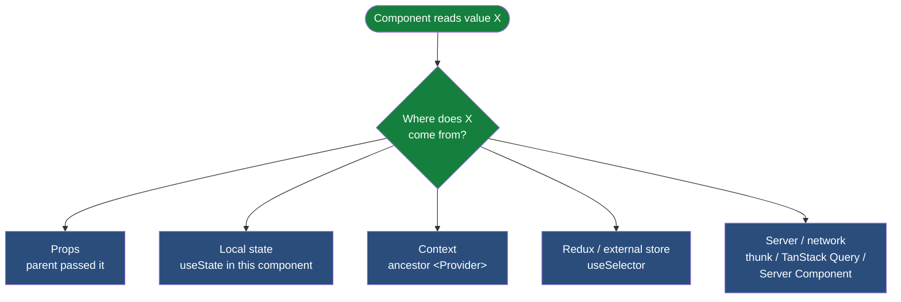

# React — production patterns

> Companion to the [`react-redux`](../projects/react-redux/) project. The Redux doc treats React as the *consumer* of Redux; this doc treats React itself as the subject. The pattern lens is the same: not "what is the API" but "what decisions do you have to defend when someone asks why your component is shaped this way."

If `redux-toolkit.md` is about coordinating state that does not belong in any one component, this doc is about everything *before* you reach for Redux — the part of the React mental model that decides where state lives, when effects belong, and why a re-render is not a re-paint. Get this layer right and most of the bugs that look like Redux bugs disappear, because they were never Redux's fault.

## The component model

A React component is a function from props to a description of UI. Not an object, not a class, not a controller. The shift from class components to function components is a deeper conceptual shift than the syntax change suggests: a function component cannot have a hidden lifecycle, a private instance variable, or a `this.setState` race condition. It can only ask React, on each render, for the state and the side effects it needs.

The implications are practical:

- **No `this`.** State and effects come from hooks, not from instance fields. If you find yourself wanting a "this," you are looking at either a `useRef` (for a mutable value that should not trigger re-render) or a `useState` (for a value that should).
- **Reuse is composition, not inheritance.** Class hierarchies are a finished chapter. The reuse unit in modern React is a custom hook or a child component. If two components share logic, extract a hook; if they share UI, extract a child.
- **The function body runs every render.** A `console.log` at the top of your component runs every time React decides to render that component. Internalize this; many "why is this firing twice" questions vanish.

Class components still work and millions of lines of production code use them. New code should be functions. If you must touch a class component, the rule is the same as touching any old code: change as little as possible, port the surrounding components first, and resist the urge to rewrite while you are debugging an unrelated bug.

## The render mental model

Three vocabulary words worth distinguishing precisely:

| Word | What it means |
|---|---|
| **Render** | React calls your component function. The function returns a description of the UI (a React element tree). |
| **Commit** | React applies the diff between the new tree and the previous tree to the DOM. |
| **Paint** | The browser draws the updated DOM. This is outside React's control. |

"Re-render" does not mean "the screen flickered." It means "React called the function again." If the returned tree is identical to the previous one, the DOM does not change. If the returned tree differs in one prop on one element, the DOM update is exactly that one prop.


The expensive thing is "P" — DOM patches — and it is *proportional to the diff*, not to the number of re-renders. A re-render that produces an empty diff costs almost nothing. A re-render that produces a huge diff (every row of a 10,000-row list) is what you want to avoid.

The expensive thing is *unnecessary* re-renders that produce a large diff. The cheap thing is a re-render that returns the same tree. Performance work in React is usually about reducing the diff, not about reducing the renders.

**The reference-equality discipline.** React decides "did this prop change?" by `===` reference comparison, not by deep equality. This is the single most common source of "why is this re-rendering" surprises. Inline objects (`style={{ color: 'red' }}`) and inline functions (`onClick={() => doThing()}`) are new references on every render. Most of the time this does not matter; sometimes — inside a memoized child or a `useEffect` dependency array — it produces an infinite loop or a re-render storm. Knowing when reference equality matters is the difference between debugging this in 5 minutes and in 5 hours.

## State, properly

Three places state can live, in order of locality:

| Where | When to put state there |
|---|---|
| **Component-local (`useState`)** | The value is used by this component and its children only |
| **Lifted to a common ancestor** | Two siblings need to coordinate; one parent owns the state |
| **Context** | Many descendants need the value, but most do not change it (theme, locale, current user) |
| **Redux store** | State that needs to be addressed independently of the component tree, time-traveled, or shared across feature boundaries (see `redux-toolkit.md`) |

The discipline that experienced engineers internalize: **start as local as possible, lift only when you need to.** A draft input value, a hover state, the open-state of a dropdown — these almost never belong in Redux. The Redux store is for state with a *life of its own* across the app; component-local state is for everything that dies when the component unmounts.

A second axis: **`useState` vs `useReducer`.** Both are local state, but they shape change differently:

- `useState` — one value, one setter. Best for values that change independently of other values.
- `useReducer` — multiple related values that transition together as a unit. Best when the next state depends on multiple previous values, or when the transitions are complex enough to name. A useReducer is a state machine without the framework.

A small rule that catches the common case: if you find yourself calling two setters back-to-back (`setLoading(false); setData(d);`), the values belong together and `useReducer` will make the code clearer.

## `useEffect` — what it's for and what it's NOT

`useEffect` is the single most misused hook. The mental model that fixes 80% of the misuse:

> An effect synchronizes React with something that lives **outside** React.

"Outside React" means: the network, the DOM directly, a subscription, a third-party library, a `setInterval`, `localStorage`. These are systems with their own state machine that React has to mirror. The effect's job is to make React's view of that system consistent every time React's state changes.

If the thing you are trying to do does not involve anything outside React, you almost certainly do not need an effect.

The four banned uses (each is a real anti-pattern that shows up constantly):

| Anti-pattern | What's actually correct |
|---|---|
| `useEffect` to fetch primary view data | In modern stacks: Server Components fetch on the server; TanStack Query in client components; or `loader` in a routing library. `useEffect` for data fetching is a 2020 pattern that the ecosystem has moved past. (The `react-redux` project still uses it because it exercises `createAsyncThunk` explicitly — the move-on is named in the docs.) |
| `useEffect` to derive state from props | A derived value is just a variable: `const fullName = first + ' ' + last;` lives in the function body, not in a `useState + useEffect`. |
| `useEffect` to respond to a state change with another state change | If state A changes, and that should cause state B to change, do it in the event handler that changed A — not in a `useEffect` that watches A. The handler is the cause; the effect would be the cause's cousin once removed. |
| `useEffect(() => fetch(...))` from a form's submit | A form submit is an event, not a synchronization. Call the API in the submit handler. In Next.js, this is what Server Actions are for. |

The non-banned uses, where effects are exactly the right tool:

- Setting up a WebSocket or EventSource subscription
- Adding/removing a `window` event listener
- Starting a `setInterval` that needs to be cleared on unmount
- Imperatively focusing a DOM element after a state change
- Syncing with a non-React third-party library (a chart, a map, a video player)

The cleanup function pattern (`return () => ...`) is the discipline that makes effects safe. Every subscription, listener, or interval that an effect creates must be torn down in cleanup. Without it, unmounting the component leaves a dangling listener that fires forever.

## Where data comes from

When you read a value inside a component, it came from exactly one of five places. Naming them clearly is half the battle:



| Source | When | Example |
|---|---|---|
| **Props** | Parent passed it down | `<UserCard user={user} />` |
| **Local state** | This component owns it | `const [draft, setDraft] = useState('')` |
| **Context** | An ancestor `<Provider>` exposed it | `const theme = useContext(ThemeContext)` |
| **Redux / external store** | Centralized client state | `const items = useSelector(s => s.comments.items)` |
| **Server / network** | Lives on the server; we have a snapshot | Fetched via thunk, TanStack Query, Server Component, or loader |

When you encounter a stale-data bug, the first question is: *which of these five is the value coming from?* The answer determines the fix. A stale prop means the parent has not re-rendered. A stale context means the Provider's value is the same reference. A stale Redux value means a stale snapshot or a missing refetch. A stale server snapshot means the cache is older than its TTL.

This taxonomy is more useful than it sounds because most state-management debates collapse the moment you name the source. "Should this live in Redux?" is the wrong question; the right question is "which of the five sources, and why?"

## The Provider pattern

`<Provider value={...}><App /></Provider>` shows up in three places that look unrelated but are the same idea:

1. **React Context.** `<MyContext.Provider value={x}>` exposes `x` to every descendant via `useContext(MyContext)`. The descendant subscribes; React re-renders the subscribed descendants when the value reference changes.
2. **Redux.** `<Provider store={store}>` from `react-redux` exposes the Redux store the same way. `useSelector` is a context-aware subscription.
3. **Theming, i18n, auth, feature flags.** Every cross-cutting concern that needs to reach many components but rarely changes uses this pattern.

The performance gotcha: the value of a Context is reference-compared on every render. If you write `<Provider value={{ user, theme }}>`, you create a *new object* on every render, which re-renders every consumer even when nothing meaningfully changed. The fix is `useMemo` for the value object, or — better — split into multiple narrower contexts so each has a stable reference.

## Strict Mode

In development, React 18+ wraps your app in `<StrictMode>` and intentionally runs effects twice and renders components twice. This is not a bug; it is a feature.

What Strict Mode is doing: simulating the "the user navigated away and came back" case. If your effect sets up a subscription, runs once, mounts a thing, etc., Strict Mode runs it twice to verify the cleanup actually cleans up. If cleanup is correct, the second run produces an identical state. If cleanup is missing or wrong, the second run leaves duplicated listeners, interval timers, etc. — and you find the bug in dev instead of in prod.

The cost is mental: console logs print twice; `useEffect` bodies run twice; "why is this fetching twice" is a daily question. The benefit is real: every effect cleanup gets exercised in dev. Disable Strict Mode and the bugs ship.

In production, the double-run does not happen.

## Composition patterns

The hooks-first composition rule: **share logic via custom hooks, share UI via child components.**

A custom hook is a function whose name starts with `use` and which calls other hooks. It can return anything — a value, a tuple, an object of values and setters. The pattern is the *same* shape as `useState` or `useEffect`; the consumer cannot tell the difference, which is why custom hooks compose so cleanly.

```js
// One hook, used wherever the pattern applies.
function useDebouncedValue(value, ms) {
  const [debounced, setDebounced] = useState(value);
  useEffect(() => {
    const id = setTimeout(() => setDebounced(value), ms);
    return () => clearTimeout(id);
  }, [value, ms]);
  return debounced;
}
```

A few production-grade custom hooks worth recognizing because they show up in every real codebase: `useLocalStorage`, `useDebouncedValue`, `useOnClickOutside`, `useMediaQuery`, `useEventListener`, `useInterval` (with proper cleanup), `usePrevious`, `useIsMounted`.

The "container vs presentational" split that older articles describe is a finished pattern. It tried to separate "what data" from "what UI" before hooks existed. Hooks let any component pull its own data without losing testability or reusability. Today the cleaner split is "components compose, hooks reuse logic."

## What this points to next

Most of the patterns above are about *client-side* React — the world in which the entire app runs in the browser and effects synchronize React with the network. That world is being absorbed into a larger one:

- **Server Components** move data fetching to the server. Most "fetch on mount" code becomes an `async` component on the server. `useEffect` for primary data goes away.
- **Server Actions** move mutations to the server. Most "submit handler that calls an API" code becomes a `"use server"` function. The thunk lifecycle, the loading state, the cache invalidation — all collapse into one server-side function.
- **TanStack Query** handles client-side server state for what is left — interactive views, real-time updates, anything that needs to refetch on focus or maintain a normalized cache.

The pieces above do not invalidate the foundation in this doc; they layer on top of it. The render mental model is the same. The reference-equality discipline is the same. State decisions still start local and lift. `useEffect` is still for synchronizing with outside-React systems — there is just less *outside-React* to synchronize with, because more of the work moved to the server.

The [`react-server-components`](../projects/react-server-components/) and [`tanstack-query`](../projects/tanstack-query/) projects (planned) will demonstrate the next layer. This doc is the durable foundation underneath.
