# Redux Toolkit

Sunil Mogadati

---

## 1. About this doc

The problem is architectural. React solves rendering very well, but it does not solve coordination of shared state across distant components in a large app. When state has to be shared by many components scattered through the tree, React's prop-based data flow breaks down at scale.

The architecture is centralized state with strict update discipline: one store, immutable transitions, unidirectional data flow, an action log you can replay. The coordination problem becomes a single source of truth.

The patterns are well-established CS techniques: event sourcing for the action log, CQRS for separating reads from writes, the observer pattern for subscriptions, immutability and pure functions for predictability, the chain of responsibility for middleware.

The API most apps use today is Redux Toolkit, which reduces what used to be 40 lines of boilerplate per feature down to a few. The five core pieces: `createSlice`, `configureStore`, `createAsyncThunk`, `useSelector`, `useDispatch`.

The judgment closes the doc: Redux is not for every app, or every kind of state. Knowing when to reach for it is half the value of knowing how to use it.

The sections that follow walk through each of these in order.

---

## 2. What is Redux

Redux is a JavaScript library for managing application data, specifically the kind of data that many parts of an app need to read and update together.

Three things to anchor:

- It is not React-specific. Redux works with React, Angular, Vue, or plain JavaScript. The patterns are framework-agnostic.
- It centralizes data in a single store. An app has exactly one store, giving you one place to look for the current state.
- It enforces a predictable update pattern. Data only changes through dispatched actions, processed by pure reducers.

We will use React for examples since that's the most common pairing, but the architecture applies anywhere.

---

## 3. A brief on React

- React is a JavaScript library for building user interfaces. Components are functions that take input (props) and return JSX, a description of what should appear on screen.

Here is a small example. A parent component (`Greeting`) holds local state and passes it down to a child component (`Hello`) as a prop:

```jsx
import { useState } from "react";

// Parent component. Owns local state via React's useState hook.
function Greeting() {
  const [name, setName] = useState("World");
  return (
    <div>
      <input value={name} onChange={(e) => setName(e.target.value)} />
      <Hello name={name} />
    </div>
  );
}

// Child component. Receives data through props and renders it.
function Hello({ name }) {
  return <h1>Hello, {name}!</h1>;
}
```

`useState` is React's built-in hook for local component state. Calling `useState("World")` returns a current value and a setter function. When the user types in the input, the parent calls `setName(...)`, React re-runs `Greeting`, the new `name` flows down to `Hello` as a prop, and `Hello` re-renders with the new value.

What the rendered page looks like in the browser:

```
+-----------------------------------+
|  World                            |   <-- input (editable)
+-----------------------------------+

  Hello, World!                          <-- h1 (updates as you type)
```

The HTML React produces in the real DOM is just plain HTML:

```html
<div>
  <input value="World" />
  <h1>Hello, World!</h1>
</div>
```

As the user types into the input, `setName(...)` runs in the parent, React re-runs both components, and React patches the real DOM (specifically the `value` attribute of the input and the text inside the `h1`). The rest of the DOM is untouched.

Component tree for this example:

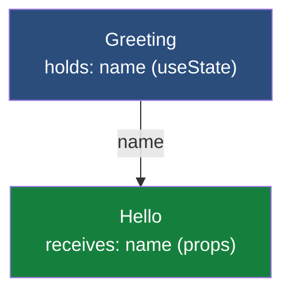

- The browser's DOM is the live HTML tree the user sees. Manipulating it directly is expensive because every change can trigger layout and paint work.
- React keeps a lightweight in-memory copy of that tree called the Virtual DOM. The Virtual DOM is fast to build and fast to compare.
- When state changes, React re-runs the affected component, produces a new Virtual DOM, compares it against the previous one (this step is called reconciliation), and patches only the changed nodes in the real DOM.


### How events reach your code

When a user clicks a button or types into an input, the browser fires a DOM event. React intercepts the event through its synthetic event system (one delegated listener on the root that routes events to the right component) and runs your component's handler. Your handler typically updates state, which triggers a re-render, which triggers reconciliation, which patches the real DOM. The user sees the result.

The handler runs in your component code first, so the component can call `event.preventDefault()` or `event.stopPropagation()` before any default browser behavior happens.

### Data flow: down through props, up through callbacks

Data in React **flows down**: a parent passes data to its children through props. Children never reach into their parents to set data directly.

But children often need to *cause* changes in state owned by a parent (or grandparent). The pattern is: the parent defines an updater function, passes it down as a prop, and the child calls it. The function runs in the parent (where the state lives), updates the state, and the new state flows back down to whichever children need it.

Extending the Greeting and Hello example makes this concrete. Suppose Hello also wants its own input box so the user can change the name from either component. Hello cannot call `setName` directly - that function lives in Greeting's scope, and Hello has no access to it. The pattern is for Greeting to pass `setName` down to Hello as a prop:

```jsx
import { useState } from "react";

function Greeting() {
  const [name, setName] = useState("World");

  return (
    <div>
      <input value={name} onChange={(e) => setName(e.target.value)} />
      {/* Pass name (data) DOWN, and pass setName (a callback) DOWN as well. */}
      <Hello name={name} onChangeName={setName} />
    </div>
  );
}

function Hello({ name, onChangeName }) {
  return (
    <div>
      <h1>Hello, {name}!</h1>
      {/* Hello's own input. When the user types here, Hello calls
          the callback it was given. That callback IS Greeting's setName,
          so the update happens back in Greeting, and the new name flows
          back down to Hello as a prop. */}
      <input value={name} onChange={(e) => onChangeName(e.target.value)} />
    </div>
  );
}
```

When the user types in Hello's input, the `onChange` handler fires `onChangeName(...)`. That function reference is Greeting's `setName`, so the update executes back in Greeting's scope. Greeting's state changes. React re-runs Greeting. The new `name` flows down to Hello as a prop. Hello renders with the new value.

Two properties of this pattern matter:

- **The child cannot mutate parent state directly.** It can only *request* a change by calling a function the parent provided. The state stays owned by the parent.
- **The child does not know what the callback does.** Hello has no idea `onChangeName` is Greeting's `setName`. Hello just calls the function it was handed. That keeps the child independent of how state is managed above it.

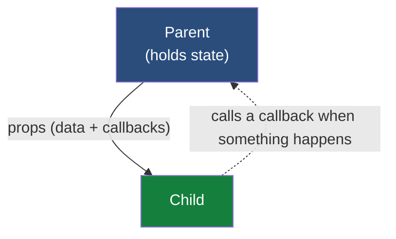

In a deep tree, "passing down" can mean threading the data through many intermediate components, and "callback up" can mean threading callbacks through the same intermediates. Imagine the same pattern, but the state lives at the top of a five-level component tree, and a deep child needs to trigger an update. The updater function has to be passed down through every intermediate component, even ones that don't use it. That double-threading is the **prop drilling problem** we will see next, and it is one of the things Redux is designed to eliminate.

---

## 4. Why Redux exists: the problem in a real React app

Take Amazon.com as a real example. A page like that has dozens of components: the header with logo, search bar, and user menu; the navigation; product cards in a grid; related items in a sidebar; the cart badge; reviews on a product page; the footer.

The component tree looks something like this:

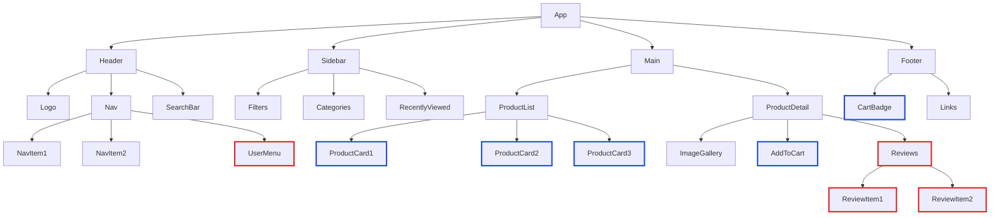

Red borders mark components that need user data. Blue borders mark components that need cart data.

These components are scattered across the tree. To get user data from `App` down to `ReviewItem`, the data has to pass through four intermediate components, none of which actually use it.

Here is what that chain looks like in isolation:

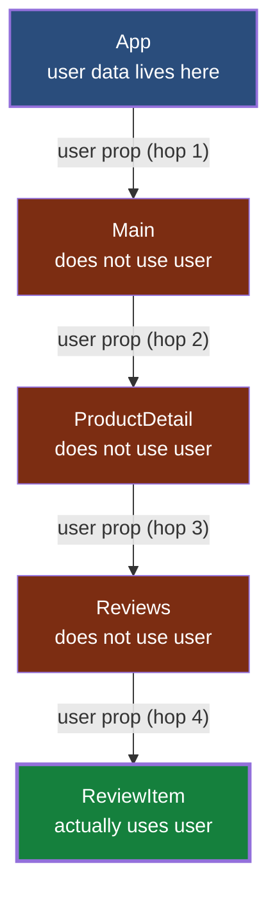

Four hops. Three of them carry data they don't need. The destination is the only component that actually uses it.

And that is just the **read path**. If `ReviewItem` also needs to *update* user data (say, a sign-out button), `App` must pass an updater callback down through the same four hops. When the child calls the callback, the function runs back in `App` (where the state actually lives), `App` updates the state, and the new state then flows back down through the same chain. A single update round-trips the carriers twice: once for the callback going down, and once for the new state coming back down.

This is **prop drilling**.

### React renders. React does not coordinate.

It is worth being precise about what kind of problem this is. React itself is excellent at rendering: given some state, it puts the right pixels on screen efficiently. That part is not the bug. The bug is that **getting the right state into the right components, consistently, across a large tree, is hard**.

These are not rendering problems. They are **coordination** problems. The cart badge in the header has to agree with the cart page. The user menu has to agree with the login state. When the user adds an item, ten different components have to update *in a way that stays consistent*.

React doesn't solve coordination. It renders whatever state you give it. Redux is one of the cleanest answers to the coordination problem.

---

## 5. The two costs of prop drilling

### Cost 1: Components in the chain carry props they don't use

```jsx
// Main doesn't care about user data, but has to carry it
function Main({ user, cart }) {
  return <ProductDetail user={user} cart={cart} />;
}

// ProductDetail also doesn't care about user
function ProductDetail({ user, cart }) {
  return (
    <>
      <AddToCart cart={cart} />
      <Reviews user={user} />
    </>
  );
}
```

Refactoring becomes painful. Adding a new field to user means touching every component in the chain.

### Cost 2: Re-render cascades

To share user data with components deep in the tree, you have to keep the user state at a level high enough that it can flow down to all of them. In our example, that means at `App` (the top of the tree), using `useState` there.

In React, when a component's state changes, that component re-renders. And when a parent re-renders, all of its children re-render too by default. So a state change in `App` (the only place where user state lives) cascades down the entire tree, including subtrees that don't use user data at all.

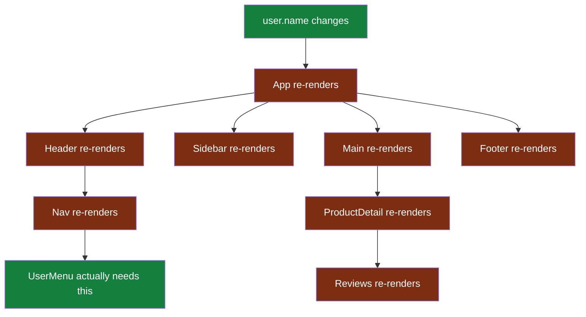

Only `UserMenu` actually needed to re-render. Everything else is wasted work.

You can mitigate some of this with `React.memo`, `useMemo`, and `useCallback`, but those are engineering effort spent on a symptom. The root cause is where the state lives.

---

## 6. The Redux solution: a centralized store

Move shared data out of the component tree entirely. Put it in a store. Components subscribe directly to the slice they care about.

Here is what subscribing looks like in actual React code (a preview of the integration we will cover later):

```jsx
import { useSelector } from "react-redux";

function CommentCount() {
  // Subscribes directly to the store, no props passed in.
  const count = useSelector((state) => state.comments.items.length);
  return <span>{count} comments</span>;
}
```

`CommentCount` does not receive comment data through props. It pulls directly from the store. It also does not care which other components also use the same data.

Here is the contrast against the prop-drill chain we just traced:

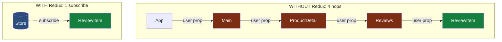

Four hops become one subscription. `ReviewItem` no longer needs to know that `Main`, `ProductDetail`, and `Reviews` even exist.

Apply this pattern across the whole tree and the store becomes the hub:

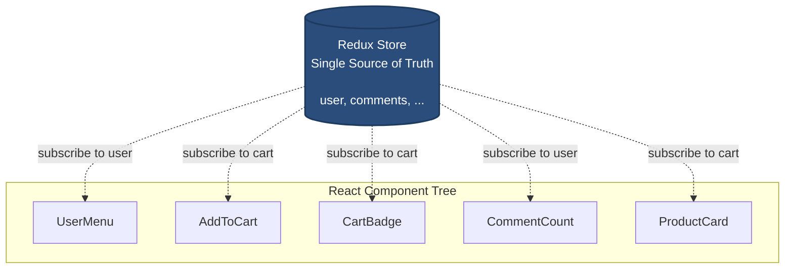

Three benefits:

- No prop drilling. Components grab what they need directly.
- No wasted re-renders. When cart changes, only the cart subscribers re-render.
- One place to look when debugging state.

It is worth being explicit about what this pattern eliminates:

- **No more lifting state up.** You no longer need to place shared state at the lowest common ancestor of every component that uses it. The store is the common ancestor for the entire app.
- **No more drilling callbacks down.** A deep component that needs to *update* shared state no longer requires the parent to pass an updater function through every intermediary. The component dispatches directly.
- **No more round-trips through carriers.** The "callback goes down, function runs in the parent, new state flows back down through the chain" pattern from Section 4 disappears. The update happens in one place (the reducer), and only the subscribers that actually care are notified.

This is the problem Redux was designed to solve.

---

## 7. Stepping into Redux: the framework-agnostic core

From here through Section 15, we leave React behind and focus on Redux itself. Everything in these sections (`createSlice`, `configureStore`, `createAsyncThunk`, `dispatch`, `subscribe`, middleware, debugging) works in any JavaScript environment: a vanilla web app, a Node script, a Vue or Angular project, or a React app. React comes back in Section 16 when we wire the store into a UI.

### An architectural gap calls for an architectural solution

React solves rendering well. What it does not solve is the coordination of shared state across distant components in a large application. That is an **architectural gap** in React's design, intentional or otherwise: React was built to render, not to manage application-wide state. The gap shows up only when an app grows large enough that many components need to share, read, and update the same data.

Architectural gaps call for architectural solutions, not patches. Redux fills this one with a synthesis of well-established CS patterns: **event sourcing** for the action log, **CQRS** for separating reads from writes, the **observer pattern** for component subscriptions, **pure functions and immutability** for predictability, the **chain of responsibility** for middleware. None of these are unique to Redux. They are software architecture techniques that have been used to make complex systems debuggable and maintainable across many domains.

The structural elements you are about to see (action, reducer, store, immutability) are direct implementations of those patterns. Section 9 unpacks the full design-pattern genealogy after you have seen the API; for now, just know that this is established CS architecture, not arbitrary discipline. It exists because the problem it solves is structural.

### The architecture at a glance

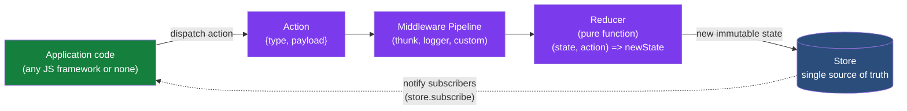

A user event in your application code dispatches an action. The action flows through any middleware, reaches the reducer, which produces a new immutable state. The store updates. Anything that subscribed to the store (via `store.subscribe`) gets notified.

That is the entire architecture. Everything else (RTK, `createSlice`, `createAsyncThunk`) is convenience built on top.

Now let's break down each piece.

### Action

A plain JavaScript object describing what happened.

```js
{ type: "comments/addComment", payload: { text: "Great answer!" } }
```

`type` is required. `payload` is convention.

### Action types

The `type` field is what identifies the action. It is a string, conventionally formatted as `"sliceName/actionName"`:

- `"comments/addComment"` - the comments slice's addComment action
- `"users/signIn"` - the users slice's signIn action
- `"comments/fetchComments/fulfilled"` - the fetchComments thunk's fulfilled phase (Section 14)

Two things to know about action types:

1. The reducer's `switch` statement (in plain Redux) or the key in the `reducers` object (in `createSlice`) is matched against this string. That is how the store knows which reducer code path to run for a given action.

2. With `createSlice`, action types are **auto-generated**. You write `addComment` as a key in the `reducers` object, and RTK generates `"comments/addComment"` as the action's type. You do not declare or import type constants by hand.

The slash-separated convention is not a Redux requirement. Redux just compares strings. But the `slice/action` format makes it easy to scan a DevTools log and see which slice each action belongs to.

### Reducer

A pure function that takes the current state and an action, and returns the next state.

```js
function reducer(state = [], action) {
  switch (action.type) {
    case "comments/addComment":
      return [...state, { id: nextId(), text: action.payload.text, likes: 0 }];
    case "comments/removeComment":
      return state.filter((c) => c.id !== action.payload.id);
    default:
      return state;
  }
}
```

A pure function means:

- Same input produces the same output, always.
- No side effects (no API calls, no random numbers, no current time).
- No mutation of the input. Return a new state object.

**You never call the reducer directly.** The only way to trigger a state change in Redux is to dispatch an action into the store. The store invokes the reducer for you, passes it the current state and the action, and stores the result. This indirection is what makes middleware, devtools, and time-travel debugging possible.

### Store

Holds the state, runs reducers, notifies subscribers.

```js
import { createStore } from "redux";
const store = createStore(reducer);

store.dispatch({ type: "comments/addComment", payload: { text: "Great answer!" } });
console.log(store.getState()); // [{ id: 1, text: "Great answer!", likes: 0 }]

const unsubscribe = store.subscribe(() => console.log(store.getState()));
```

Three properties of the store worth calling out:

- **One store per application.** Not one per page, not one per feature. The entire app shares one store.
- **The state inside the store is immutable.** Each action produces a new state object. The previous state is not modified, which is what makes time-travel debugging and predictable updates possible.
- **The store lives in memory only.** It is recreated on every page load. For persistence (e.g., keeping cart contents across reloads), pair Redux with localStorage, IndexedDB, a server-side database, or a library like `redux-persist`.

### Immutability

**The state held by the store is immutable.** Each reducer must produce a new state object rather than mutating the existing one.

```js
// WRONG, mutation
state.push(newComment);

// RIGHT, immutable
return [...state, newComment];
```

Why does Redux require this?

- Redux uses **reference equality** (`prevState === nextState`) to decide whether something changed. If you mutate the existing state object, the reference stays the same, and subscribers will not see the update.
- Keeping previous states intact is what makes **time-travel debugging** possible. DevTools holds onto every prior state snapshot, and that only works because nothing mutates them.
- Predictable change detection enables fast UI updates. Selectors can compare references with `===` rather than deep-comparing entire objects, which would be slow on a large state tree.

### Middleware

The architecture diagram earlier in this section showed a middleware pipeline between the dispatched action and the reducer. Middleware is a function that runs after dispatch and before the reducer. Used for:

- Logging
- Error reporting
- API calls (thunks are middleware)
- Analytics
- Auth token injection

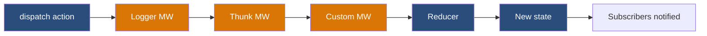

`configureStore` adds thunk and dev checks by default. You add custom middleware via `getDefaultMiddleware().concat(yourMiddleware)`.

### The data flow

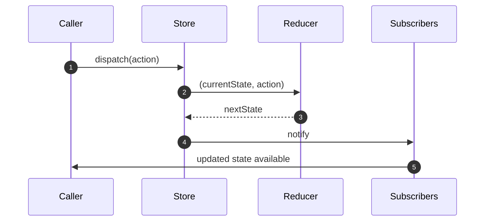

Predictable, unidirectional, and replayable. The replayable property is what makes time-travel debugging possible in DevTools.

---

## 8. Redux without RTK: the boilerplate

Redux without RTK works, but writing it is verbose.

```js
// Action type constants
const ADD_COMMENT = "comments/addComment";
const REMOVE_COMMENT = "comments/removeComment";

// Action creators
const addComment = (text) => ({ type: ADD_COMMENT, payload: { text } });
const removeComment = (id) => ({ type: REMOVE_COMMENT, payload: { id } });

// Initial state for this slice
const initialState = [];

// Reducer with switch
function commentsReducer(state = initialState, action) {
  switch (action.type) {
    case ADD_COMMENT:
      return [...state, { id: nextId(), text: action.payload.text, likes: 0 }];
    case REMOVE_COMMENT:
      return state.filter((c) => c.id !== action.payload.id);
    default:
      return state;
  }
}

// Store wiring
import { createStore, combineReducers, applyMiddleware, compose } from "redux";
import { devToolsEnhancer } from "redux-devtools-extension";

const rootReducer = combineReducers({ comments: commentsReducer });
const store = createStore(rootReducer, compose(devToolsEnhancer()));
```

For every action you need a constant, a creator, a switch case, plus the manual store wiring. You also have to declare the slice's initial state separately and pass it as the default parameter to the reducer.

The Redux team recognized this. In 2019 they released Redux Toolkit (RTK) as the official, recommended way to write Redux.

---

## 9. Redux Toolkit: what it gives you

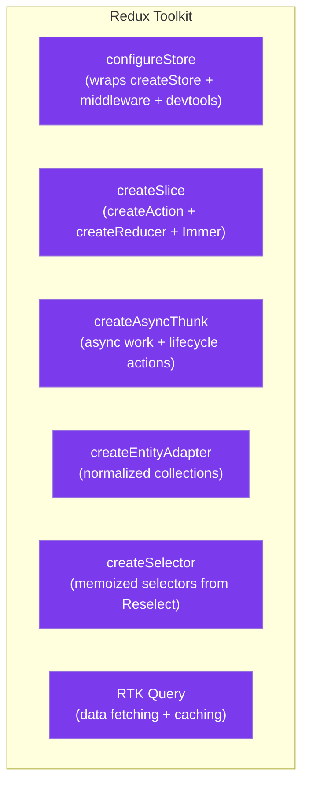

We will focus on the three most-used: `configureStore`, `createSlice`, and `createAsyncThunk`.

### The design patterns behind Redux and RTK

Redux does not rest on a single invention. It is a synthesis of well-established CS patterns that have existed in software architecture for decades. RTK then adds a second layer of design patterns on top of Redux to remove the boilerplate without changing the architecture.

Understanding this genealogy explains *why* Redux's API looks the way it does, and why senior engineers familiar with these patterns tend to find it natural rather than arbitrary.

#### Patterns Redux inherits from computer science

**1. Flux architecture (structural foundation).** Redux is a direct evolution of the Flux architecture introduced by Facebook in 2014. Flux enforced **unidirectional data flow**: events go in one direction through a dispatcher into stores and out to views. Redux simplified Flux by collapsing multiple stores into one centralized state tree and removing the explicit dispatcher object, while keeping the one-way data loop.

**2. CQRS - Command Query Responsibility Segregation.** A pattern from software architecture for separating **writes (commands)** from **reads (queries)** into two distinct pathways. Redux applies this directly: dispatched actions are commands that express intent to modify state and never return data. Selectors (and `useSelector` in React) are queries that extract read-optimized slices for the UI. The two pathways never mix.

**3. Event sourcing philosophy.** In event-sourced systems, state is not stored as a current snapshot but is *derived* from a sequential, append-only log of events. Redux applies this philosophy: state is treated as read-only and immutable; transitions are driven by an ordered stream of action objects; the current state is the result of processing those events deterministically through pure reducers. This is the property that makes time-travel debugging and audit logging possible.

**4. Observer pattern (publish-subscribe).** The Redux store acts as a central **publisher**. UI components and other consumers register as **observers** (via `store.subscribe`, or via `useSelector` in React-Redux). When a state transition completes, the store notifies all subscribers. Components receive change notifications without needing to know who triggered the change.

**5. Functional programming - pure functions and immutability.** Reducers are required to be pure functions: deterministic, no side effects, no mutation of the input. State is immutable: each transition returns a new state reference rather than modifying the existing one. These properties enable reference-equality change detection, fast selectors, and replayable action streams.

**6. Chain of responsibility (the middleware pipeline).** Middleware sits between dispatch and the reducer as a chain of handlers, each of which can inspect, transform, log, delay, or short-circuit an action before passing it down the chain. This is a classic Chain of Responsibility pattern, and it is what makes asynchronous work (thunks), logging, and analytics cleanly composable.

#### Patterns RTK adds on top of Redux

**7. Proxy pattern (Immer in `createSlice`).** RTK integrates the Immer library inside `createSlice`. When you write code that looks like mutation (`state.items.push(...)`), Immer wraps the state in a JavaScript Proxy that intercepts the operations, tracks the attempted mutations, and produces a new immutable copy under the hood. The Proxy pattern is what bridges familiar mutable-style JavaScript with the immutability constraint Redux requires.

**8. Slice pattern (`createSlice` co-location).** Classic Redux fragments a single feature across three or four files: action type constants, action creators, reducers, and store wiring. RTK's `createSlice` co-locates the slice's name, initial state, and reducers into a single block, and **auto-generates the action types and action creators** from the reducer keys. This is a structural pattern - locality of related concerns - that eliminates the most common Redux boilerplate complaint.

**9. Facade pattern (`configureStore`).** Classic Redux store setup requires manual composition of `createStore`, `combineReducers`, middleware enhancers, and DevTools integration. RTK's `configureStore` is a **facade**: a single high-level interface that hides this assembly. It automatically combines reducers, includes the thunk middleware, wires the Redux DevTools extension, and turns on dev-mode mutation/serializability checks. One function call replaces several lines of boilerplate.

#### Why this matters

For an engineer learning Redux, knowing these patterns by name is more than trivia. It tells you that:

- The discipline Redux requires (immutability, pure functions, unidirectional flow) is the *same* discipline that scales complex systems in any domain. It is not arbitrary.
- The friction of vanilla Redux (constants, action creators, switch statements) was a code-organization problem that RTK solved with well-known structural patterns, not by abandoning the architecture.
- The features senior engineers value most (time-travel debugging, action audit logs, predictable updates, middleware composition) fall out of these patterns automatically. They are architectural payoffs, not features that had to be built.

When you read someone else's Redux code, you are reading an implementation of these patterns. Recognizing them lets you reason about the code at the level of intent, not just syntax.

---

## 10. `createSlice`: building a slice

A **slice** is one feature's piece of the application state, plus the actions that can change it. Each slice usually corresponds to one domain in your app: comments, users, cart, notifications, and so on. A slice owns one top-level key in the store, the reducers that handle changes to that key, and the action types those reducers respond to.

You define each slice first (with `createSlice`), then bundle them into the store (with `configureStore`). Here is what a slice looks like:

```js
import { createSlice } from "@reduxjs/toolkit";

let id = 0;

const commentsSlice = createSlice({
  name: "comments",
  initialState: { items: [], loading: "idle", error: null },
  reducers: {
    addComment: (state, action) => {
      state.items.push({
        id: ++id,
        text: action.payload.text,
        likes: 0,
      });
    },
    removeComment: (state, action) => {
      state.items = state.items.filter((c) => c.id !== action.payload.id);
    },
    likeComment: (state, action) => {
      const c = state.items.find((c) => c.id === action.payload.id);
      if (c) c.likes += 1;
    },
  },
});

export const { addComment, removeComment, likeComment } = commentsSlice.actions;
export default commentsSlice.reducer;
```

That one block gives you:

- Action types auto-generated as `"comments/addComment"`, `"comments/removeComment"`, `"comments/likeComment"`.
- Action creators exported from `slice.actions`.
- A reducer exported as default.

---

## 11. About `state.items.push(...)`: is that mutation?

It looks like mutation. It is safe. `createSlice` wraps your reducers with **Immer**, which **converts your mutable-looking code into immutable state updates**.

Immer hands your code a proxy of the state. You write code that looks like mutation. Immer tracks the changes and produces a new immutable state object under the hood.

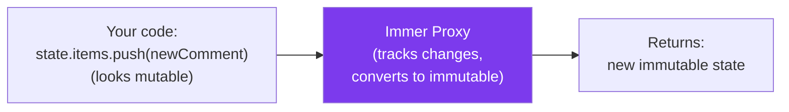

You write what looks like mutation, which is simpler and more familiar to most JavaScript developers, while still getting the correctness of immutable state. This conversion is the main reason Redux Toolkit eliminated the boilerplate complaint.

---

## 12. `configureStore`

Once your slices are defined, `configureStore` bundles them into the application store:

```js
import { configureStore } from "@reduxjs/toolkit";
import commentsReducer from "./features/comments/commentsSlice";
import usersReducer from "./features/users/usersSlice";

const store = configureStore({
  reducer: {
    comments: commentsReducer,
    users: usersReducer,
  },
});

export default store;
```

What `configureStore` does for you automatically:

- Wires Redux DevTools, with no manual `devToolsEnhancer` call.
- Adds `redux-thunk` middleware. Async work just works.
- Combines multiple reducers from the `reducer` object, with no separate `combineReducers` call.
- Adds dev-mode checks for accidental state mutation and non-serializable values.
- Strips devtools in production builds.

### How the store routes actions to reducers

When you dispatch an action, **the store sends it to every slice's reducer**. Redux does not guess which reducer should handle the action. Each reducer checks the action type and either returns a new state for its slice or returns the existing state unchanged.

With `createSlice`, the "no match, return current state" behavior is automatic. If the dispatched action's type matches one of the names in the slice's `reducers` (or one of the cases in its `extraReducers`), that handler fires and updates the slice. Otherwise, the slice's state stays untouched.

This is also what makes cross-slice listening possible: a slice can use `extraReducers` to react to actions defined in *other* slices, because every action reaches every reducer.

---

## 13. Sample store object: what's actually inside

When you call `store.getState()`, here is the structure of what it returns.

```js
{
  comments: {
    items: [
      { id: 1, text: "Great answer!", likes: 4 },
      { id: 2, text: "Could you elaborate?", likes: 0 }
    ],
    loading: "idle",
    error: null
  },
  users: {
    current: { id: 42, name: "Sunil" },
    list: []
  }
}
```

Each top-level key is a slice. Each slice is owned by one `createSlice` call. Slices don't know about each other. They are independent.

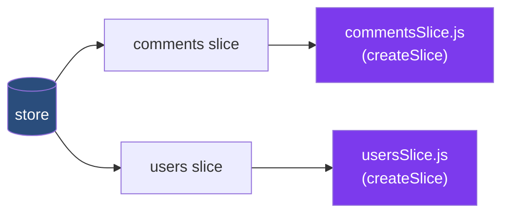

This maps cleanly to a feature-based folder structure:

```
src/features/
  comments/commentsSlice.js
  users/usersSlice.js
```

---

## 14. `createAsyncThunk`: async work

### Why does API work belong inside Redux at all?

A fair question to ask first: why does an API call need to go through Redux? Could the application code just call the API directly and dispatch a single plain action when the data comes back?

```js
// "Skip Redux for the fetch" approach
async function loadComments() {
  const res = await fetch("/api/comments");
  const data = await res.json();
  dispatch({ type: "comments/loaded", payload: data });
}
```

This works. For very simple cases, it is reasonable. But it has gaps that compound as the app grows:

- **Loading state is not in the store.** While the fetch is in flight, no part of the app knows that "a fetch is happening." If several components need to show loading spinners, each tracks loading state locally.
- **Error state is not in the store.** If the fetch fails, nothing in the store reflects that. Each caller has to handle errors itself.
- **The pattern is not standardized.** Some developers will manually dispatch a "loading started" action; others will not. Code reviews drift.
- **Time-travel debugging captures only the outcome.** Replaying the log shows the final `loaded` action, but the "started" moment is missing.

`createAsyncThunk` solves all of this by **standardizing the lifecycle**. Every async operation is modeled as three phases (start, success, failure), and an action is dispatched for each phase. The store reflects the full lifecycle, not just the outcome.

The right framing: the question is not "should the API call go through Redux." The question is "do you want the *progress* of an async operation reflected in your central state, or only the *result*?" `createAsyncThunk` gives you the progress.

### What is a thunk?

A **thunk** is a function that wraps deferred work. In Redux, a thunk is dispatched like an action, but instead of being a plain `{type, payload}` object that immediately hits the reducer, it is a function that runs some logic (typically an API call) first and dispatches actions based on the outcome.

The plain Redux flow is: dispatch action → reducer updates state.
The thunk flow is: dispatch thunk → middleware runs the thunk → thunk dispatches one or more **plain action objects** → reducers update state.

The actions the thunk dispatches are ordinary `{type, payload}` data, exactly like a synchronous action. For `createAsyncThunk` specifically, the thunk dispatches `{ type: "comments/fetchComments/pending" }` on entry, then either `{ type: "comments/fetchComments/fulfilled", payload: <api response> }` or `{ type: "comments/fetchComments/rejected", error: <error info> }` when the work completes.

**A thunk is not a pure function.** It calls APIs, generates timestamps, reads from network, does any side effect it needs. This is fine, because the thunk runs in middleware, not in the reducer. What matters is that the actions the thunk *dispatches* are plain `{type, payload}` data objects, and the reducers that handle those actions are still pure. The thunk's impurity is captured inside the action payload (for example, the API response becomes the payload of `fetchComments.fulfilled`). Once captured, the action is just data.

### The code

```js
import { createAsyncThunk, createSlice } from "@reduxjs/toolkit";

export const fetchComments = createAsyncThunk(
  "comments/fetchComments",
  async () => {
    const res = await fetch("https://jsonplaceholder.typicode.com/comments?_limit=3");
    if (!res.ok) throw new Error("Failed to fetch comments");
    const data = await res.json();
    return data.map((c) => ({ id: c.id, text: c.body.slice(0, 80), likes: 0 }));
  }
);
```

One call to `createAsyncThunk` generates three action types automatically.

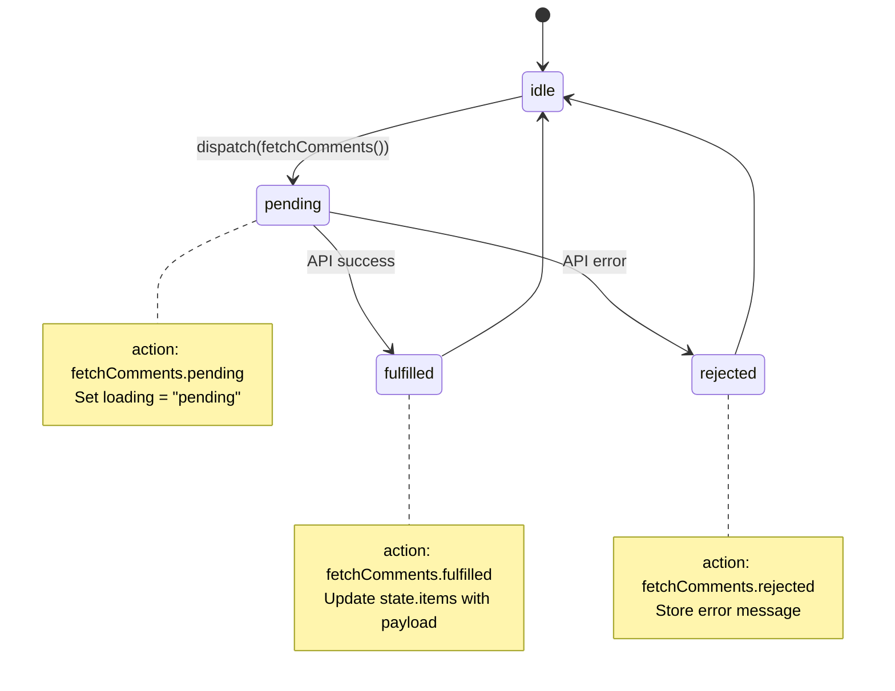

### Who calls what, and when

This is the precise sequence when application code dispatches a thunk:

1. **The application code** calls `dispatch(fetchComments())`.
   - `fetchComments()` is invoked first. It returns a *function*, which is the thunk itself.
   - `dispatch` is then called with that function as its argument.

2. **The thunk middleware** sees that the dispatched value is a function, not a plain `{type, payload}` object. It intercepts the function before it reaches any reducer.

3. **The middleware calls the function**, passing `dispatch` and `getState` to it. This is where the API call actually runs.

4. **The function dispatches plain action objects** based on the API outcome. With `createAsyncThunk`, this happens automatically:
   - On entry: `dispatch({ type: "comments/fetchComments/pending" })`
   - On success: `dispatch({ type: "comments/fetchComments/fulfilled", payload: <api response> })`
   - On failure: `dispatch({ type: "comments/fetchComments/rejected", error: <error info> })`

5. **Each of those plain actions** flows through the normal Redux pipeline: middleware chain → reducers → store update → subscribers notified. The reducers in question are the ones declared in the slice's `extraReducers` (covered below).

The application code does not call the reducer. The thunk does not call the reducer. Every state change still goes through `dispatch` and the reducer, exactly like for synchronous actions. The thunk is just a way to *defer* the dispatch until the async work resolves.

### Why three actions, not one?

**All three actions update the store.** Pending and rejected are not just "UI things" - they modify the store's `loading` and `error` fields. Those store updates are what *cause* the UI to change. The UI is just rendering whatever the store currently holds.

Each phase needs different state, which is why three actions exist instead of one:

- `pending`: marks loading as in-progress, clears any previous error.
- `fulfilled`: marks loading as done, writes the API response into the data field.
- `rejected`: marks loading as done, writes the error message into the error field.

If `createAsyncThunk` produced only a single "completed" action, every reducer would need to inspect the payload to figure out which phase actually happened (success vs. failure) and whether the spinner should still show. With three distinct actions, each phase has its own clean handler in `extraReducers`.

**What each action does (concretely):**

| Action | What `extraReducers` writes to the store | What the UI then renders |
|---|---|---|
| `fetchComments.pending` | `state.loading = "pending"`, `state.error = null` | "Loading initial comments…" |
| `fetchComments.fulfilled` | `state.loading = "idle"`, `state.items = action.payload` | The list of comments |
| `fetchComments.rejected` | `state.loading = "idle"`, `state.error = action.error.message` | An error banner |

The UI never imports the action types directly. It just reads `state.comments.loading`, `state.comments.error`, and `state.comments.items` from the store and renders accordingly. The three-action design decouples *what happens in the store* from *what the UI shows*.

**One more benefit: Redux DevTools time-travel.** Because each phase is a distinct action in the log, you can step backward and forward through pending, fulfilled, and rejected to inspect exactly what the state looked like at each moment. With a single combined action you would only see the final outcome, not the loading state in between.

### `extraReducers`: where the slice listens to the thunk

The slice's regular `reducers` block defines actions **owned by this slice**. Their action types are auto-generated using the slice's name (for example, `comments/addComment`). You cannot use `reducers` to handle actions that come from outside the slice.

The thunk's three lifecycle actions (`pending`, `fulfilled`, `rejected`) are defined **externally** by `createAsyncThunk`. They are not actions this slice owns; `createAsyncThunk` created them. So we need a separate block to handle them.

**`extraReducers` is the listener block.** It says "when these (externally defined) actions are dispatched anywhere in the app, here is how this slice should react." You list the action by reference (`fetchComments.pending`) and provide the handler.

```js
const commentsSlice = createSlice({
  name: "comments",
  initialState: { items: [], loading: "idle", error: null },
  reducers: { /* synchronous reducers from before */ },
  extraReducers: (builder) => {
    builder
      .addCase(fetchComments.pending, (state) => {
        state.loading = "pending";
      })
      .addCase(fetchComments.fulfilled, (state, action) => {
        state.loading = "idle";
        state.items = action.payload;
      })
      .addCase(fetchComments.rejected, (state, action) => {
        state.loading = "idle";
        state.error = action.error.message;
      });
  },
});
```

### Cross-slice listening

`extraReducers` is also how one slice listens to actions from a different slice. For example, the `comments` slice can react to a `users/signOut` action by clearing its cached comments when the user signs out:

```js
// commentsSlice.js
import { signOut } from "../users/usersSlice";

const commentsSlice = createSlice({
  name: "comments",
  initialState: { items: [], loading: "idle", error: null },
  reducers: { /* comment-owned actions */ },
  extraReducers: (builder) => {
    builder
      .addCase(fetchComments.pending, ...)
      .addCase(fetchComments.fulfilled, ...)
      .addCase(fetchComments.rejected, ...)
      .addCase(signOut, (state) => {
        // When the user signs out, clear cached comments.
        state.items = [];
        state.loading = "idle";
        state.error = null;
      });
  },
});
```

The regular `reducers` block cannot do this. It only defines new actions owned by the current slice. `extraReducers` is the general mechanism for "react to actions defined elsewhere."

This works because of the routing rule from Section 12: when an action is dispatched, the store sends it to every slice's reducer. Each slice decides whether to react.

`createAsyncThunk` itself has no React dependency. It works in plain JavaScript apps too.

---

## 15. Debugging with Redux DevTools

A browser extension (Chrome, Firefox, Edge) that gives you:

- Every dispatched action, in order
- The state tree at any point in history
- Time-travel: step backward and forward through actions
- Replay on hot reload, so your app picks up where it left off
- Export and import of session state

RTK's `configureStore` wires this up automatically. It is stripped in production builds.

### What you see in the Redux tab

When you open the Redux DevTools tab, the panel splits into two parts.

**Left panel: the action log.** Chronological list of every action dispatched, starting with `@@INIT` (the action Redux fires when the store is created). Each entry shows the action type (for example, `comments/addComment`) and a timestamp. Click any action to inspect it.

**Right panel: four views of the selected action.**

| Tab | What it shows |
|---|---|
| **Action** | The dispatched action object: `{ type, payload }`. Useful for confirming the payload contents. |
| **State** | The complete state tree at the moment of that action. Same structure as `store.getState()`. |
| **Diff** | A colored diff showing exactly what changed between the previous state and this one. The most useful tab for tracing bugs. |
| **Trace** | Stack trace of where the action was dispatched. Requires `trace: true` in the store config. |

### What a diff looks like

For an action like `comments/likeComment` with `payload: { id: 1 }`, the Diff tab shows:

```
comments.items[0].likes:
  - 0
  + 1
```

One field changed. Everything else stayed identical. This is the visible proof of immutability and reference equality: when only one slice of state changes, only that slice's subscribers are notified.

### Time-travel: the architectural payoff

Click any prior action in the log and the UI rewinds to that state. Click forward through actions to step through state changes one by one. This works because every dispatched action produces a new immutable state snapshot, and DevTools keeps all of them in memory.

The **play button** (bottom of the action log) auto-advances through the actions at a fixed interval. At each step, DevTools sets the store's current state to the snapshot it recorded for that action, and any subscribed UI updates accordingly. It is **replay of state transitions, not re-execution of action handlers**: the reducers already ran, and DevTools has the resulting states cached. Nothing is being recomputed; you are watching the recorded history at playback speed.

Time-travel is also the proof that the Redux constraints (pure reducers, immutable state, dispatch-only changes) actually function as a system. If reducers had side effects or mutated state, rewinding would not be possible.

### What "replay" actually means

It is worth being precise about this. "Replay" in Redux can mean two different things, both enabled by the same architectural property:

**Snapshot restore.** This is what DevTools does when you click an earlier action in the log. The reducers do not re-run. DevTools simply sets the store's current state to the cached snapshot it recorded at that moment. The reducers already ran when the action was originally dispatched; DevTools just remembers the result. This is why the click is instant.

**Actual replay.** This is when the action stream is re-dispatched through the reducers from an initial state, and the entire history is recomputed. Two places this happens in practice:

- **Hot module reload with state preservation (development).** When you change a reducer's code and save the file, DevTools can re-dispatch every recorded action through the new reducer code. State is recomputed from scratch. This is what makes "fix a bug in the reducer, see the corrected state at the same point in history" possible.
- **Production session replay (e.g., LogRocket).** When a production tool records the action stream during a user's session, an engineer can later dispatch that stream against the same reducers in a debug environment. The reducers re-run. The full state at every step is reproduced. Bug at action 47? The engineer can recreate the user's exact state at action 46 and step into action 47.

Both flavors rely on the same property: reducers are pure functions. Given the same initial state and the same sequence of actions, you always reach the same final state. Snapshots are an optimization on top of this (cache the results); actual replay is the structural truth underneath. So when the doc says "an action log you can replay," it means literally that. The architecture supports both modes; the choice between them is an implementation detail of the tool.

### Dev tool, production property

The time-travel UI you see in the browser extension is a **development-only** experience. `configureStore` automatically strips the Redux DevTools integration from production builds, so end users never get this interface, and the action history is not retained in memory in production.

But the *architectural property* that enables time-travel - every state change being a dispatched, serializable, replayable action - is permanent. It works the same way in production as in development. That property is what production audit and replay tools exploit.

A small middleware can log every dispatched action to a server:

```js
const auditMiddleware = (store) => (next) => (action) => {
  fetch("/api/audit", {
    method: "POST",
    body: JSON.stringify({
      type: action.type,
      payload: action.payload,
      timestamp: Date.now(),
      userId: store.getState().users.current?.id,
    }),
  });
  return next(action);
};
```

That is enough for a complete production audit trail. Real-world tools take this further:

- **LogRocket** records full user sessions in production, including every Redux action and state diff. Support engineers can replay exactly what the user saw and did when they hit a bug.
- **Sentry** can attach the last *N* actions to a crash report so the engineer debugging it sees the full lead-up.
- Compliance-sensitive systems can log every action to an immutable store (S3, append-only DB) to maintain a regulatory audit trail.

The distinction worth holding onto: time-travel debugging is dev-only, but the architectural discipline that *makes time-travel possible* is what powers production observability. You opt into the production audit layer by adding a middleware; the rest of Redux is already doing the work.

### What about thunks? They have side effects

A natural question: if time-travel depends on purity, how does it work with `createAsyncThunk`? Thunks are not pure. They call APIs, generate timestamps, can fail in different ways on different runs.

**Time-travel never re-runs the thunk.** It re-applies the recorded action stream against the same pure reducers.

When the thunk originally executed, it dispatched concrete actions like `{ type: "comments/fetchComments/fulfilled", payload: [{ id: 1, text: "Great answer!", likes: 0 }, ...] }`. The API response is *captured inside the action payload as plain data* at the moment the fetch resolved. Once captured, the action is no longer dependent on the network or the time of day. It is just an object in the DevTools log.

When you time-travel back to that action, DevTools restores the state snapshot it recorded at that moment. The thunk does not re-execute. The fetch does not fire again. You are replaying a sequence of pure data records through pure reducers, which is deterministic by construction.

The architectural division is:

- **Side-effectful work** (thunks, middleware, I/O operations) lives outside the reducer cycle and *produces* actions.
- **Pure work** (actions, reducers, state transitions) is what gets recorded and replayed.

That separation is exactly why Redux can offer time-travel even in apps that hit real APIs.

---

## 16. React integration: hooks and async work

### The five-step setup

Putting everything together, the modern RTK + React pattern is five steps in this exact order:

1. **`createSlice`**: define the slice (name, initial state, reducers). Auto-generates action types and action creators.
2. **`configureStore`**: bundle slices into the store. Wires devtools, thunk middleware, and dev-mode checks automatically.
3. **`<Provider store={store}>`**: wrap your app at the root. Makes the store available to every component below.
4. **`useSelector`**: read from the store. Subscribes the component to a slice and re-renders when that slice changes.
5. **`useDispatch`**: fire actions. Returns the dispatch function, which you call with the action creators from your slice.

That is the entire integration. Everything else (`createAsyncThunk`, `extraReducers`, middleware) plugs into these five steps without changing the pattern. The rest of this section unpacks each step.

### Provider, useSelector, useDispatch

The `react-redux` library provides two hooks for functional components.

**One-time setup at the root:**

```jsx
import { Provider } from "react-redux";
import store from "./store";

<Provider store={store}>
  <App />
</Provider>
```

**Then in any component:**

```jsx
import { useDispatch, useSelector } from "react-redux";
import { addComment, likeComment, removeComment } from "./features/comments/commentsSlice";

function CommentsList() {
  const comments = useSelector((state) => state.comments.items);
  const dispatch = useDispatch();

  return (
    <ul>
      {comments.map((c) => (
        <li key={c.id}>
          {c.text} ({c.likes} likes)
          <button onClick={() => dispatch(likeComment({ id: c.id }))}>Like</button>
          <button onClick={() => dispatch(removeComment({ id: c.id }))}>Remove</button>
        </li>
      ))}
      <button onClick={() => dispatch(addComment({ text: "New comment" }))}>Add</button>
    </ul>
  );
}
```

What each piece does:

- **`<Provider store={store}>`** makes the store available to every component below via React's Context system. You set it once at the root and never think about it again.
- **`useSelector((state) => state.comments.items)`** does two things at once:
  1. **Reads** the current value from the store by running the selector function you pass in.
  2. **Subscribes** the component to the store, so after every dispatched action it re-runs the selector and compares the new result to the previous one (using `===` reference equality). If different, the component re-renders with the new value.

  **A note that catches many readers.** You do *not* also need `useState` to make this re-render happen. `useSelector` is itself a re-render trigger, the same way `useState` is. The mental model:

  | Mechanism | What it watches | What triggers a re-render |
  |---|---|---|
  | `useState` | a value local to this component | the setter being called |
  | `useSelector` | a slice of the Redux store | that slice changing (by reference) |

  A component reading `loading` and `error` from the store needs only `useSelector` for that data - not `useState`. It may *also* use `useState` for purely local UI state (a draft input value, whether a modal is open), but that is separate state, not Redux state.
- **`useDispatch()`** returns the store's `dispatch` function. This is the only way to trigger a state change from a component: you never call reducers yourself. You call `dispatch` with an action creator from your slice (like `addComment({ text: "..." })`) or a raw action object, and it fires the action through middleware to the reducer.

Two hooks. That is the entire React integration in 2026.

Before React hooks existed, `react-redux` required a Higher-Order Component (HOC) called `connect` that wrapped your component. You defined `mapStateToProps` (which state slices to inject as props) and `mapDispatchToProps` (which actions to inject as props), and `connect` returned a new component with those props attached. It worked but added boilerplate and made components harder to reason about. The hooks API (`useSelector` and `useDispatch`) replaced this pattern. You may still see `connect` in older codebases; for new code, use the hooks.

### How it wires together

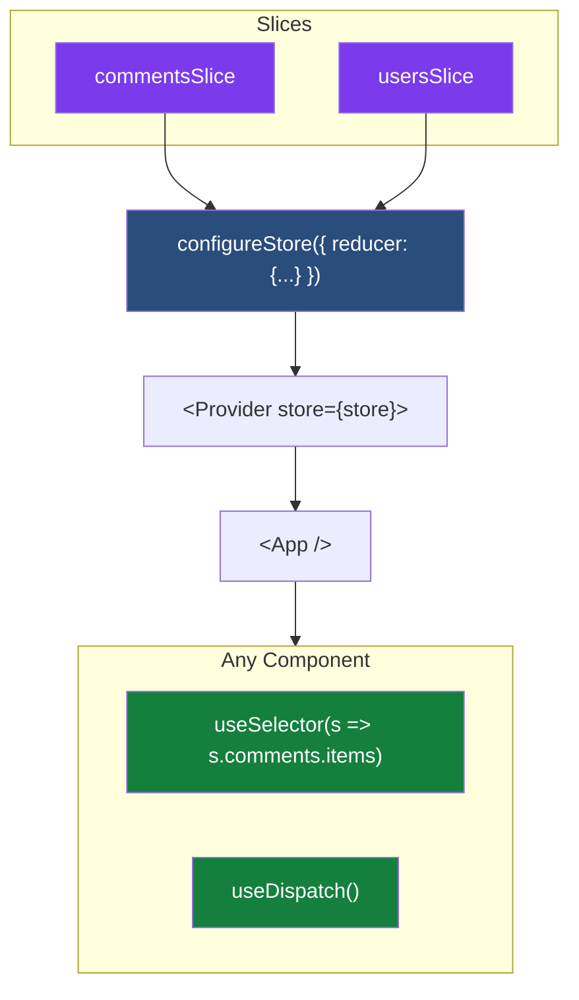

### Async work from a component

In practice, most components need to kick off async work as well: fetch data on mount, save on form submit, and so on. Dispatching a `createAsyncThunk`-based thunk from a component works identically to dispatching a synchronous action: call `dispatch(thunkName(args))`. The common pattern is firing the thunk from React's `useEffect` when the component appears:

```jsx
import { useEffect } from "react";
import { useDispatch, useSelector } from "react-redux";
import {
  fetchComments,
  addComment,
} from "./features/comments/commentsSlice";

function CommentsList() {
  const dispatch = useDispatch();
  const items = useSelector((state) => state.comments.items);
  const loading = useSelector((state) => state.comments.loading);
  const error = useSelector((state) => state.comments.error);

  // Fetch initial data once on mount.
  useEffect(() => {
    dispatch(fetchComments());
  }, [dispatch]);

  if (loading === "pending") return <p>Loading…</p>;
  if (error) return <p>Error: {error}</p>;

  return (
    <ul>
      {items.map((c) => <li key={c.id}>{c.text}</li>)}
      <button onClick={() => dispatch(addComment({ text: "New comment" }))}>
        Add
      </button>
    </ul>
  );
}
```

What happens on mount:

1. `dispatch(fetchComments())` runs. The thunk middleware intercepts it.
2. The thunk dispatches `fetchComments.pending` immediately. `state.comments.loading` becomes `"pending"`. `useSelector` notices the change, the component re-renders, the user sees "Loading…".
3. The API call resolves. The thunk dispatches `fetchComments.fulfilled` with the response as payload. `state.comments.items` is replaced with the new data.
4. `useSelector` notices again, the component re-renders, and the list appears.
5. If the API had failed instead, the thunk would dispatch `fetchComments.rejected` with the error. `state.comments.error` would be populated, and the component would render the error message.

The `dispatch` function returned by `useDispatch` is stable across renders (always the same function reference), so the `useEffect` dependency array does not change and the effect runs only once on mount. This is the standard pattern for "load this data when the component appears."

### The practical payoff of three actions

Notice how each of the three thunk actions maps directly to a UI branch in the code above:

| Thunk action | Slice updates | Component renders |
|---|---|---|
| `fetchComments.pending` | `state.comments.loading = "pending"` | `<p>Loading…</p>` |
| `fetchComments.rejected` | `state.comments.error = "..."` | `<p>Error: ...</p>` |
| `fetchComments.fulfilled` | `state.comments.items = [...]` | `<ul>...</ul>` |

This is the practical payoff of the three-action design. The component reads simple `loading` and `error` fields from state and renders one of three branches. No conditional logic inside a single "completed" handler. No payload inspection. The complexity of the async lifecycle stays inside the slice's `extraReducers`; the component stays clean.

If `createAsyncThunk` produced just one action, every component using async data would need to inspect the payload, check a status field, and branch on it inline. Three actions push that complexity into the slice once, and every consuming component benefits.

The complete React + Redux integration in one component: `useSelector` to read, `useDispatch` to write, `useEffect` to kick off side effects on mount.

### One important note on `useSelector`

`useSelector` re-renders the component when its return value changes, using reference equality (`===`).

```jsx
// GOOD: returns the same array reference if items haven't changed
const comments = useSelector((state) => state.comments.items);

// BAD: returns a NEW array every render, because .map() always creates a new array.
// This forces an unnecessary re-render on every dispatched action.
const commentTexts = useSelector((state) => state.comments.items.map((c) => c.text));
```

The fix: do not create new arrays or objects inside the selector function. Two options:

**Option 1: Select existing references.** Pick what is already in the state tree, don't transform it. Do the transformation in the component (where the cost is one render, not every render).

**Option 2: Use `createSelector` for memoized derived data.** `createSelector` is a function from the **Reselect** library. Reselect is a separate npm package that is re-exported by RTK, so you can import `createSelector` directly from `@reduxjs/toolkit` without installing anything extra. It builds a memoized selector: if the inputs (existing references in the state tree) have not changed, it returns the cached result instead of re-running the transformation.

```js
import { createSelector } from "@reduxjs/toolkit";

// Input selector: picks a stable reference from state.
const selectCommentItems = (state) => state.comments.items;

// Memoized selector: transforms items to texts only when items actually changes.
const selectCommentTexts = createSelector(
  [selectCommentItems],
  (items) => items.map((c) => c.text)
);

// In your component:
const commentTexts = useSelector(selectCommentTexts);
```

The transformation runs once on first call, and then only when `state.comments.items` becomes a new reference (i.e., when the slice actually changed). On subsequent renders, `useSelector` gets the same cached array, the `===` check passes, and the component does not re-render.

This is a production gotcha. Easy to write, easy to ship, hard to debug when your app re-renders unexpectedly.

---

## 17. The reference projects

The patterns in this document are implemented in two runnable projects in this repository.

[**`projects/redux-plain-js/`**](../projects/redux-plain-js/) demonstrates Redux Toolkit in plain JavaScript, with no React in the picture. The script logs every state change to the console as it dispatches actions through `createSlice` reducers, `createAsyncThunk` lifecycle handlers, and a cross-slice `signOut` listener. Useful for understanding the Redux side without any framework noise.

[**`projects/react-redux/`**](../projects/react-redux/) wires the same primitives into a React UI. `<Provider>` at the root, `useDispatch` and `useSelector` in the component, `useEffect` to fire `createAsyncThunk` on mount, and full loading/error rendering. Open the Redux DevTools browser extension to watch every action fire and to step backward through state with time-travel.

Both projects use Vite. From either folder:

```bash
npm install
npm run dev
```

Each project has its own `README.md` listing which files to read first and what to look for in the running app.

---

## 18. Where Redux fits in 2026

Modern React in 2026 has more tools. Server Components (the Next.js App Router model) handle a lot of what used to require Redux for server data. RTK Query is RTK's data-fetching companion if most of your state is server data.

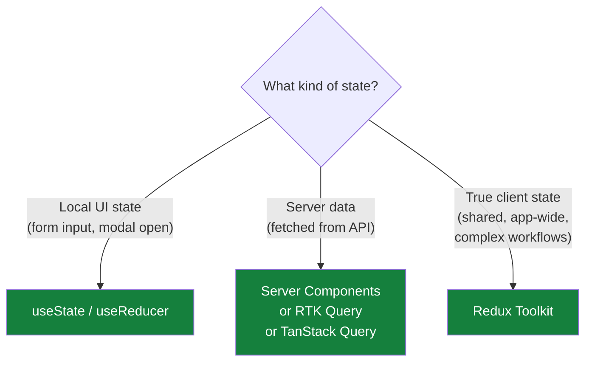

A quick note on `useReducer`. It is a React built-in hook (alongside `useState`) for local component state. It works like a miniature Redux pattern scoped to a single component: you provide a reducer function and an initial state, and it returns `[state, dispatch]`. Reach for it when local state involves several related fields or complex transitions that a single `useState` would make awkward. It is still local; Redux is what you use when the state needs to be shared across components.

Reach for Redux when state is shared across many distant components, when you need time-travel debugging or replay, or when you are modeling complex client workflows like multi-step forms or undo/redo.

Skip Redux when a `useState` would do, when the data lives on the server (use Server Components or a query library), or when React Context handles your scope cleanly.

Redux is the architectural answer to coordinating state at scale. It applies the same discipline that complex systems require everywhere - immutable transitions, single source of truth, replayable history - and trades a small amount of upfront ceremony for substantial downstream predictability. For the right kind of state, that trade is exactly right.
