# Redux Toolkit

Sunil Mogadati

---

## 1. What we'll cover

- What Redux is and why it exists
- Why a large React app eventually needs it, visualized
- Core concepts: actions, reducers, immutability, the store
- How Redux Toolkit (RTK) simplifies Redux, with working code
- React integration with `useDispatch` and `useSelector`
- Recent developments: Server Components and where Redux fits in 2026

---

## 2. What is Redux

Redux is a JavaScript library for managing application data, specifically the kind of data that many parts of an app need to read and update together.

Three things to anchor:

- It is not React-specific. Redux works with React, Angular, Vue, or plain JavaScript. The patterns are framework-agnostic.
- It centralizes data in a single store. An app has exactly one store, giving you one place to look for the current state.
- It enforces a predictable update pattern. Data only changes through dispatched actions, processed by pure reducers.

We will use React for examples since that's the most common pairing, but the architecture applies anywhere.

---

## 3. A brief on React

- React is a JavaScript library for building user interfaces. Components are functions that take input (props) and return JSX, a description of what should appear on screen.
- The browser's DOM is the live HTML tree the user sees. Manipulating it directly is expensive because every change can trigger layout and paint work.
- React keeps a lightweight in-memory copy of that tree called the Virtual DOM. The Virtual DOM is fast to build and fast to compare.
- When state changes, React re-runs the affected component, produces a new Virtual DOM, compares it against the previous one (this step is called reconciliation), and patches only the changed nodes in the real DOM.

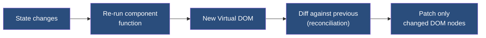

### How events reach your code

When a user clicks a button or types into an input, the browser fires a DOM event. React intercepts the event through its synthetic event system (one delegated listener on the root that routes events to the right component) and runs your component's handler. Your handler typically updates state, which triggers a re-render, which triggers reconciliation, which patches the real DOM. The user sees the result.

The handler runs in your component code first, so the component can call `event.preventDefault()` or `event.stopPropagation()` before any default browser behavior happens.

### Data flow: down through props, up through callbacks

Data in React **flows down**: a parent passes data to its children through props. Children never reach into their parents to set data directly.

But children often need to *cause* changes in state owned by a parent (or grandparent). The pattern is: the parent defines an updater function, passes it down as a prop, and the child calls it. The function runs in the parent (where the state lives), updates the state, and the new state flows back down to whichever children need it.

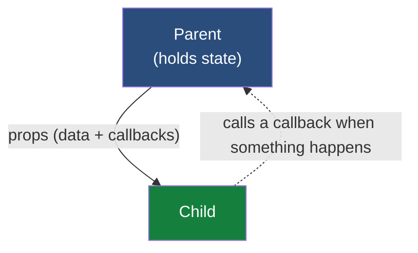

In a deep tree, "passing down" can mean threading the data through many intermediate components, and "callback up" can mean threading callbacks through the same intermediates. That double-threading is the **prop drilling problem** we will see next.

---

## 4. Why Redux exists: the problem in a real React app

Take Amazon.com as a real example. A page like that has dozens of components: the header with logo, search bar, and user menu; the navigation; product cards in a grid; related items in a sidebar; the cart badge; reviews on a product page; the footer.

The component tree looks something like this:

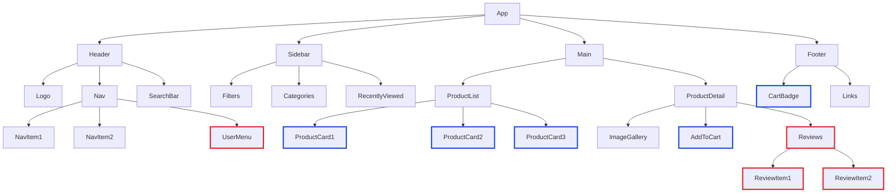

Red borders mark components that need user data. Blue borders mark components that need cart data.

These components are scattered across the tree. To get user data from `App` down to `ReviewItem`, the data has to pass through four intermediate components, none of which actually use it.

Here is what that chain looks like in isolation:

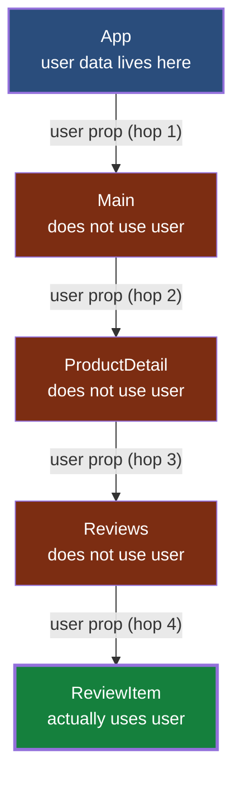

Four hops. Three of them carry data they don't need. The destination is the only component that actually uses it.

And that is just the **read path**. If `ReviewItem` also needs to *update* user data (say, a sign-out button), `App` must pass an updater callback down through the same four hops. When the child calls the callback, the function runs back in `App` (where the state actually lives), `App` updates the state, and the new state then flows back down through the same chain. A single update round-trips the carriers twice: once for the callback going down, and once for the new state coming back down.

This is **prop drilling**.

---

## 5. The two costs of prop drilling

### Cost 1: Components in the chain carry props they don't use

```jsx
// Main doesn't care about user data, but has to carry it
function Main({ user, cart }) {
  return <ProductDetail user={user} cart={cart} />;
}

// ProductDetail also doesn't care about user
function ProductDetail({ user, cart }) {
  return (
    <>
      <AddToCart cart={cart} />
      <Reviews user={user} />
    </>
  );
}
```

Refactoring becomes painful. Adding a new field to user means touching every component in the chain.

### Cost 2: Re-render cascades

To share user data with components deep in the tree, you have to keep the user state at a level high enough that it can flow down to all of them. In our example, that means at `App` (the top of the tree), using `useState` there.

In React, when a component's state changes, that component re-renders. And when a parent re-renders, all of its children re-render too by default. So a state change in `App` (the only place where user state lives) cascades down the entire tree, including subtrees that don't use user data at all.

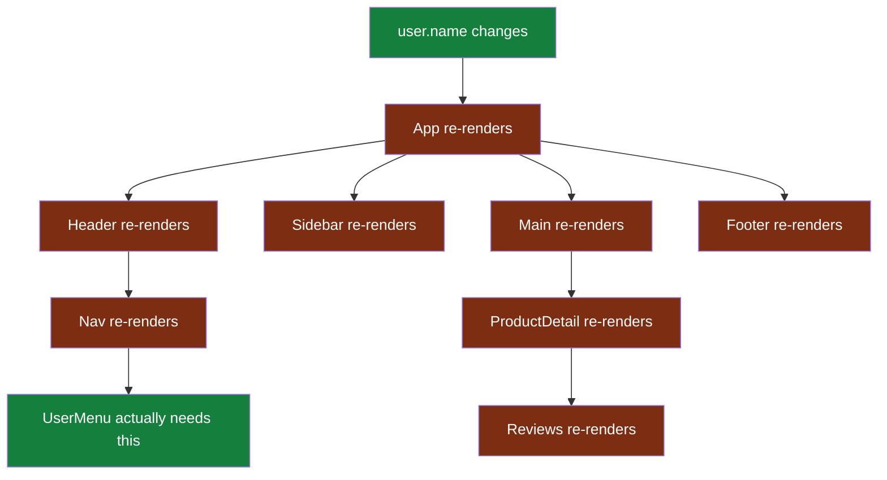

Only `UserMenu` actually needed to re-render. Everything else is wasted work.

You can mitigate some of this with `React.memo`, `useMemo`, and `useCallback`, but those are engineering effort spent on a symptom. The root cause is where the state lives.

---

## 6. The Redux solution: a centralized store

Move shared data out of the component tree entirely. Put it in a store. Components subscribe directly to the slice they care about.

Here is what subscribing looks like in actual React code (a preview of the integration we will cover later):

```jsx
import { useSelector } from "react-redux";

function CommentCount() {
  // Subscribes directly to the store, no props passed in.
  const count = useSelector((state) => state.comments.items.length);
  return <span>{count} comments</span>;
}
```

`CommentCount` does not receive comment data through props. It pulls directly from the store. It also does not care which other components also use the same data.

Here is the contrast against the prop-drill chain we just traced:

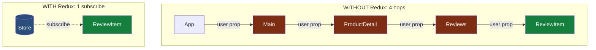

Four hops become one subscription. `ReviewItem` no longer needs to know that `Main`, `ProductDetail`, and `Reviews` even exist.

Apply this pattern across the whole tree and the store becomes the hub:

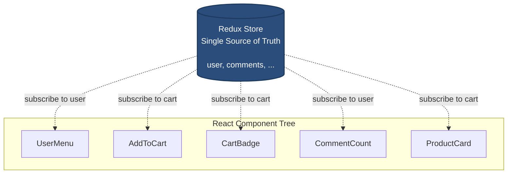

Three benefits:

- No prop drilling. Components grab what they need directly.
- No wasted re-renders. When cart changes, only the cart subscribers re-render.
- One place to look when debugging state.

Three properties of the store worth calling out:

- **One store per application.** Not one per page, not one per feature. The entire app shares one store.
- **The state inside the store is immutable.** Each action produces a new state object. The previous state is not modified, which is what makes time-travel debugging and predictable updates possible.
- **The store lives in memory only.** It is recreated on every page load. For persistence (e.g., keeping cart contents across reloads), pair Redux with localStorage, IndexedDB, a server-side database, or a library like `redux-persist`.

This is the problem Redux was designed to solve.

---

## 7. Core concepts: action, reducer, store

Here is the full Redux architecture at a glance:

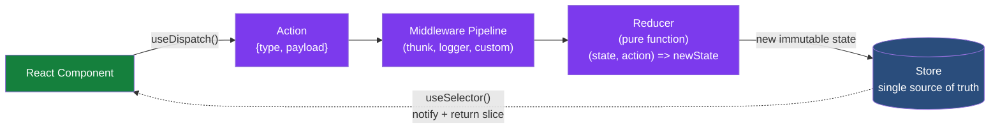

A user event in a component dispatches an action. The action flows through any middleware, reaches the reducer, which produces a new immutable state. The store updates. Subscribed components re-render with the new value.

That is the entire architecture. Everything else (RTK, `createSlice`, `createAsyncThunk`) is convenience built on top.

Now let's break down each piece.

### Action

A plain JavaScript object describing what happened.

```js
{ type: "comments/addComment", payload: { text: "Great answer!" } }
```

`type` is required. `payload` is convention.

### Reducer

A pure function that takes the current state and an action, and returns the next state.

```js
function reducer(state = [], action) {
  switch (action.type) {
    case "comments/addComment":
      return [...state, { id: nextId(), text: action.payload.text, likes: 0 }];
    case "comments/removeComment":
      return state.filter((c) => c.id !== action.payload.id);
    default:
      return state;
  }
}
```

A pure function means:

- Same input produces the same output, always.
- No side effects (no API calls, no random numbers, no current time).
- No mutation of the input. Return a new state object.

**You never call the reducer directly.** The only way to trigger a state change in Redux is to dispatch an action into the store. The store invokes the reducer for you, passes it the current state and the action, and stores the result. This indirection is what makes middleware, devtools, and time-travel debugging possible.

### Store

Holds the state, runs reducers, notifies subscribers.

```js
import { createStore } from "redux";
const store = createStore(reducer);

store.dispatch({ type: "comments/addComment", payload: { text: "Great answer!" } });
console.log(store.getState()); // [{ id: 1, text: "Great answer!", likes: 0 }]

const unsubscribe = store.subscribe(() => console.log(store.getState()));
```

### Immutability

**The state held by the store is immutable.** Each reducer must produce a new state object rather than mutating the existing one.

```js
// WRONG, mutation
state.push(newComment);

// RIGHT, immutable
return [...state, newComment];
```

Why does Redux require this?

- Redux uses **reference equality** (`prevState === nextState`) to decide whether something changed. If you mutate the existing state object, the reference stays the same, and subscribers will not see the update.
- Keeping previous states intact is what makes **time-travel debugging** possible. DevTools holds onto every prior state snapshot, and that only works because nothing mutates them.
- Predictable change detection enables fast UI updates. React's `useSelector` can compare references rather than deep-comparing entire objects, which would be slow on a large state tree.

### The data flow

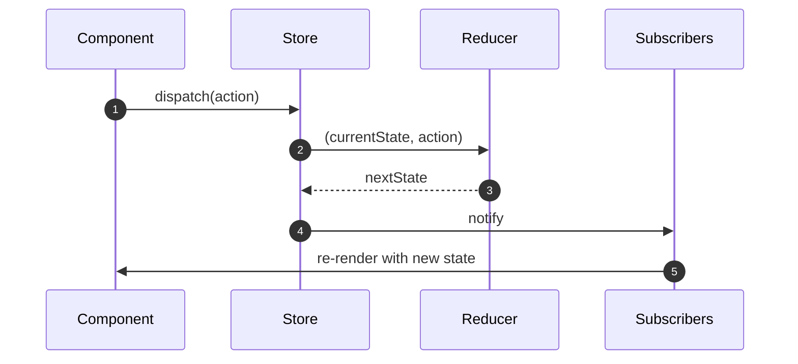

Predictable, unidirectional, and replayable. The replayable property is what makes time-travel debugging possible in DevTools.

---

## 8. Redux without RTK: the boilerplate

Redux without RTK works, but writing it is verbose.

```js
// Action type constants
const ADD_COMMENT = "comments/addComment";
const REMOVE_COMMENT = "comments/removeComment";

// Action creators
const addComment = (text) => ({ type: ADD_COMMENT, payload: { text } });
const removeComment = (id) => ({ type: REMOVE_COMMENT, payload: { id } });

// Initial state for this slice
const initialState = [];

// Reducer with switch
function commentsReducer(state = initialState, action) {
  switch (action.type) {
    case ADD_COMMENT:
      return [...state, { id: nextId(), text: action.payload.text, likes: 0 }];
    case REMOVE_COMMENT:
      return state.filter((c) => c.id !== action.payload.id);
    default:
      return state;
  }
}

// Store wiring
import { createStore, combineReducers, applyMiddleware, compose } from "redux";
import { devToolsEnhancer } from "redux-devtools-extension";

const rootReducer = combineReducers({ comments: commentsReducer });
const store = createStore(rootReducer, compose(devToolsEnhancer()));
```

For every action you need a constant, a creator, a switch case, plus the manual store wiring. You also have to declare the slice's initial state separately and pass it as the default parameter to the reducer.

The Redux team recognized this. In 2019 they released Redux Toolkit (RTK) as the official, recommended way to write Redux.

---

## 9. Redux Toolkit: what it gives you

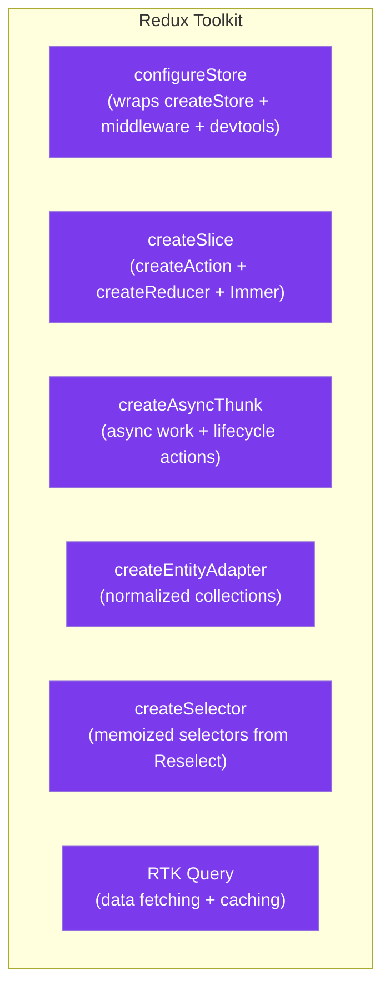

We will focus on the three most-used: `configureStore`, `createSlice`, and `createAsyncThunk`.

---

## 10. `createSlice`: the centerpiece

A **slice** is one feature's piece of the application state, plus the actions that can change it. Each slice usually corresponds to one domain in your app: comments, users, cart, notifications, and so on. A slice owns one top-level key in the store, the reducers that handle changes to that key, and the action types those reducers respond to.

You define each slice first (with `createSlice`), then bundle them into the store (with `configureStore`). Here is what a slice looks like:

```js
import { createSlice } from "@reduxjs/toolkit";

let id = 0;

const commentsSlice = createSlice({
  name: "comments",
  initialState: { items: [], loading: "idle", error: null },
  reducers: {
    addComment: (state, action) => {
      state.items.push({
        id: ++id,
        text: action.payload.text,
        likes: 0,
      });
    },
    removeComment: (state, action) => {
      state.items = state.items.filter((c) => c.id !== action.payload.id);
    },
    likeComment: (state, action) => {
      const c = state.items.find((c) => c.id === action.payload.id);
      if (c) c.likes += 1;
    },
  },
});

export const { addComment, removeComment, likeComment } = commentsSlice.actions;
export default commentsSlice.reducer;
```

That one block gives you:

- Action types auto-generated as `"comments/addComment"`, `"comments/removeComment"`, `"comments/likeComment"`.
- Action creators exported from `slice.actions`.
- A reducer exported as default.

---

## 11. About `state.items.push(...)`: is that mutation?

It looks like mutation. It is safe. `createSlice` wraps your reducers with **Immer**, which **converts your mutable-looking code into immutable state updates**.

Immer hands your code a proxy of the state. You write code that looks like mutation. Immer tracks the changes and produces a new immutable state object under the hood.

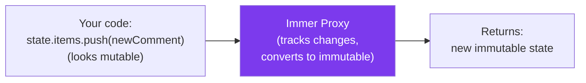

You write what looks like mutation, which is simpler and more familiar to most JavaScript developers, while still getting the correctness of immutable state. This conversion is the main reason Redux Toolkit eliminated the boilerplate complaint.

---

## 12. `configureStore`

Once your slices are defined, `configureStore` bundles them into the application store:

```js
import { configureStore } from "@reduxjs/toolkit";
import commentsReducer from "./features/comments/commentsSlice";
import usersReducer from "./features/users/usersSlice";

const store = configureStore({
  reducer: {
    comments: commentsReducer,
    users: usersReducer,
  },
});

export default store;
```

What `configureStore` does for you automatically:

- Wires Redux DevTools, with no manual `devToolsEnhancer` call.
- Adds `redux-thunk` middleware. Async work just works.
- Combines multiple reducers from the `reducer` object, with no separate `combineReducers` call.
- Adds dev-mode checks for accidental state mutation and non-serializable values.
- Strips devtools in production builds.

### How the store routes actions to reducers

When you dispatch an action, **the store sends it to every slice's reducer**. Redux does not guess which reducer should handle the action. Each reducer checks the action type and either returns a new state for its slice or returns the existing state unchanged.

With `createSlice`, the "no match, return current state" behavior is automatic. If the dispatched action's type matches one of the names in the slice's `reducers` (or one of the cases in its `extraReducers`), that handler fires and updates the slice. Otherwise, the slice's state stays untouched.

This is also what makes cross-slice listening possible: a slice can use `extraReducers` to react to actions defined in *other* slices, because every action reaches every reducer.

---

## 13. Sample store object: what's actually inside

When you call `store.getState()`, here is the structure of what it returns.

```js
{
  comments: {
    items: [
      { id: 1, text: "Great answer!", likes: 4 },
      { id: 2, text: "Could you elaborate?", likes: 0 }
    ],
    loading: "idle",
    error: null
  },
  users: {
    current: { id: 42, name: "Sunil" },
    list: []
  }
}
```

Each top-level key is a slice. Each slice is owned by one `createSlice` call. Slices don't know about each other. They are independent.

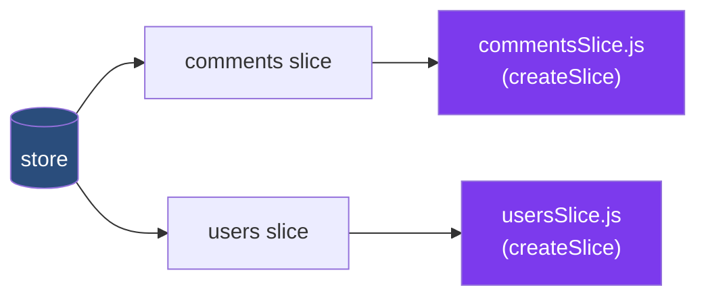

This maps cleanly to your folder structure:

```
src/features/
  comments/commentsSlice.js
  users/usersSlice.js
```

---

## 14. `createAsyncThunk`: async work

Real apps need to fetch data from servers. But Redux's reducers are pure functions: they cannot make API calls, wait for promises, or have any side effects. So async work cannot live inside reducers. It has to live somewhere else in the data flow.

The answer is **middleware**. Middleware intercepts dispatched values before they reach reducers and can do whatever it wants with them: log them, run async work, transform them, dispatch more actions. The standard Redux middleware for async work is **thunk**, and `configureStore` includes it by default.

`createAsyncThunk` is RTK's helper for the most common thunk pattern: call an API, dispatch one action when the request starts, and another action when it finishes (or fails). But first, the vocabulary.

### What is a thunk?

A **thunk** is a function that wraps deferred work. In Redux, a thunk is dispatched like an action, but instead of being a plain `{type, payload}` object that immediately hits the reducer, it is a function that runs some logic (typically an API call) first and dispatches actions based on the outcome.

The plain Redux flow is: dispatch action → reducer updates state.
The thunk flow is: dispatch thunk → middleware runs the thunk → thunk dispatches one or more actions → reducers update state.

**A thunk is not a pure function.** It calls APIs, generates timestamps, reads from network, does any side effect it needs. This is fine, because the thunk runs in middleware, not in the reducer. What matters is that the actions the thunk *dispatches* are plain `{type, payload}` data objects, and the reducers that handle those actions are still pure. The thunk's impurity is captured inside the action payload (for example, the API response becomes the payload of `fetchComments.fulfilled`). Once captured, the action is just data.

### The code

```js
import { createAsyncThunk, createSlice } from "@reduxjs/toolkit";

export const fetchComments = createAsyncThunk(
  "comments/fetchComments",
  async () => {
    const res = await fetch("https://jsonplaceholder.typicode.com/comments?_limit=3");
    if (!res.ok) throw new Error("Failed to fetch comments");
    const data = await res.json();
    return data.map((c) => ({ id: c.id, text: c.body.slice(0, 80), likes: 0 }));
  }
);
```

One call generates three action types automatically.

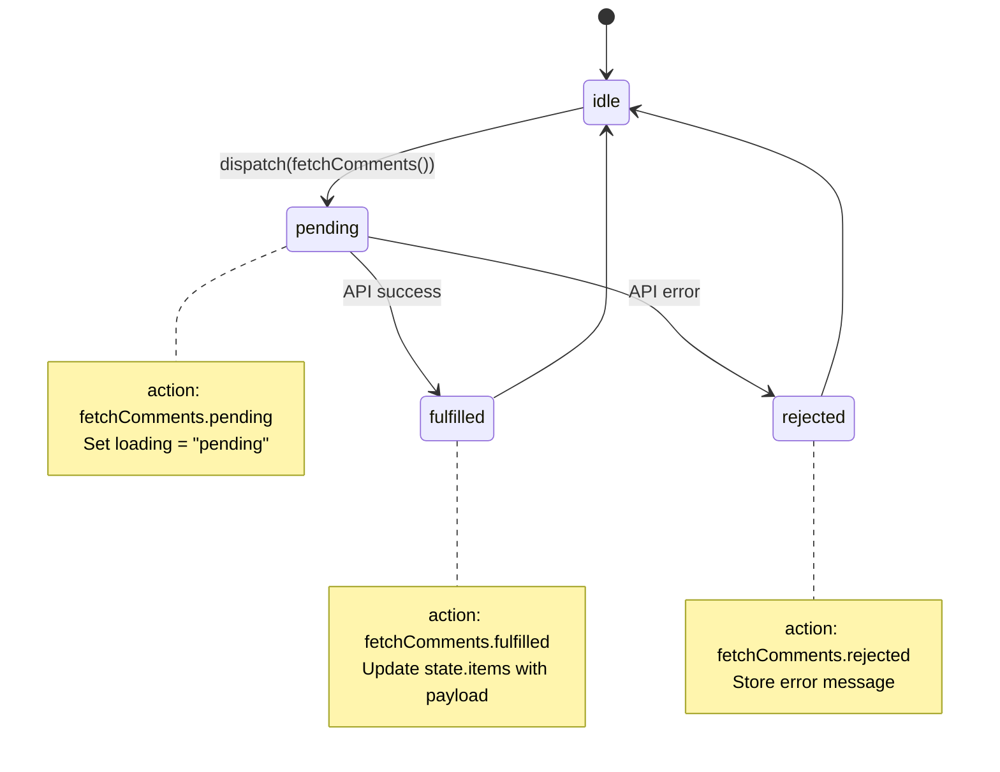

### Why three actions, not one?

Each phase of an async operation needs different UI behavior:

- `pending`: show a loading spinner or "Loading…" text, disable the submit button, insert a placeholder row.
- `fulfilled`: hide the spinner, display the data, optionally show a success toast.
- `rejected`: hide the spinner, show an error message, offer a retry button.

If `createAsyncThunk` produced only a single "completed" action, every reducer and every component would need to inspect the payload to figure out which phase actually happened. With three distinct actions, each phase has its own clean handler in `extraReducers`, and components can read simple `loading` and `error` fields from state without conditional logic.

**Where each action is used (concretely):**

| Action | Used in `extraReducers` to... | Used in the UI to... |
|---|---|---|
| `fetchComments.pending` | Set `state.loading = "pending"`, clear `state.error` | Render "Loading initial comments…" |
| `fetchComments.fulfilled` | Set `state.loading = "idle"`, replace `state.items` with the API response | Hide the loading text, render the list |
| `fetchComments.rejected` | Set `state.loading = "idle"`, save the error message to `state.error` | Hide the loading text, render an error banner |

The component never imports the action types directly. It just reads `state.comments.loading` and `state.comments.error` (via `useSelector`) and renders accordingly. The three-action design decouples *what happens in the store* from *what the UI shows*.

**One more benefit: Redux DevTools time-travel.** Because each phase is a distinct action in the log, you can step backward and forward through pending, fulfilled, and rejected to inspect exactly what the state looked like at each moment. With a single combined action you would only see the final outcome, not the loading state in between.

### `extraReducers`: where the slice listens to the thunk

The slice's regular `reducers` block defines actions **owned by this slice**. Their action types are auto-generated using the slice's name (for example, `comments/addComment`). You cannot use `reducers` to handle actions that come from outside the slice.

The thunk's three lifecycle actions (`pending`, `fulfilled`, `rejected`) are defined **externally** by `createAsyncThunk`. They are not actions this slice owns; `createAsyncThunk` created them. So we need a separate block to handle them.

**`extraReducers` is the listener block.** It says "when these (externally defined) actions are dispatched anywhere in the app, here is how this slice should react." You list the action by reference (`fetchComments.pending`) and provide the handler.

```js
const commentsSlice = createSlice({
  name: "comments",
  initialState: { items: [], loading: "idle", error: null },
  reducers: { /* synchronous reducers from before */ },
  extraReducers: (builder) => {
    builder
      .addCase(fetchComments.pending, (state) => {
        state.loading = "pending";
      })
      .addCase(fetchComments.fulfilled, (state, action) => {
        state.loading = "idle";
        state.items = action.payload;
      })
      .addCase(fetchComments.rejected, (state, action) => {
        state.loading = "idle";
        state.error = action.error.message;
      });
  },
});
```

### Cross-slice listening

`extraReducers` is also how one slice listens to actions from a different slice. For example, the `comments` slice can react to a `users/signOut` action by clearing its cached comments when the user signs out:

```js
// commentsSlice.js
import { signOut } from "../users/usersSlice";

const commentsSlice = createSlice({
  name: "comments",
  initialState: { items: [], loading: "idle", error: null },
  reducers: { /* comment-owned actions */ },
  extraReducers: (builder) => {
    builder
      .addCase(fetchComments.pending, ...)
      .addCase(fetchComments.fulfilled, ...)
      .addCase(fetchComments.rejected, ...)
      .addCase(signOut, (state) => {
        // When the user signs out, clear cached comments.
        state.items = [];
        state.loading = "idle";
        state.error = null;
      });
  },
});
```

The regular `reducers` block cannot do this. It only defines new actions owned by the current slice. `extraReducers` is the general mechanism for "react to actions defined elsewhere."

This works because of the routing rule from Section 12: when an action is dispatched, the store sends it to every slice's reducer. Each slice decides whether to react.

`createAsyncThunk` itself has no React dependency. It works in plain JavaScript apps too.

---

## 15. Middleware, briefly

Middleware is a function that runs after dispatch and before the reducer. Used for:

- Logging
- Error reporting
- API calls (thunks are middleware)
- Analytics
- Auth token injection

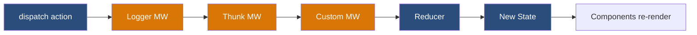

`configureStore` adds thunk and dev checks by default. You add custom middleware via `getDefaultMiddleware().concat(yourMiddleware)`.

---

## 16. Debugging with Redux DevTools

A browser extension (Chrome, Firefox, Edge) that gives you:

- Every dispatched action, in order
- The state tree at any point in history
- Time-travel: step backward and forward through actions
- Replay on hot reload, so your app picks up where it left off
- Export and import of session state

RTK's `configureStore` wires this up automatically. It is stripped in production builds.

### What you see in the Redux tab

When you open the Redux DevTools tab, the panel splits into two parts.

**Left panel: the action log.** Chronological list of every action dispatched, starting with `@@INIT` (the action Redux fires when the store is created). Each entry shows the action type (for example, `comments/addComment`) and a timestamp. Click any action to inspect it.

**Right panel: four views of the selected action.**

| Tab | What it shows |
|---|---|
| **Action** | The dispatched action object: `{ type, payload }`. Useful for confirming the payload contents. |
| **State** | The complete state tree at the moment of that action. Same structure as `store.getState()`. |
| **Diff** | A colored diff showing exactly what changed between the previous state and this one. The most useful tab for tracing bugs. |
| **Trace** | Stack trace of where the action was dispatched. Requires `trace: true` in the store config. |

### What a diff looks like

For an action like `comments/likeComment` with `payload: { id: 1 }`, the Diff tab shows:

```
comments.items[0].likes:
  - 0
  + 1
```

One field changed. Everything else stayed identical. This is the visible proof of immutability and reference equality: when only one slice of state changes, only that slice's subscribers re-render.

### Time-travel: the architectural payoff

Click any prior action in the log and the UI rewinds to that state. Click forward through actions to step through state changes one by one. This works because every dispatched action produces a new immutable state snapshot, and DevTools keeps all of them in memory.

The **play button** (bottom of the action log) auto-advances through the actions at a fixed interval. At each step, DevTools sets the store's current state to the snapshot it recorded for that action, and the components re-render. It is **replay of state transitions, not re-execution of action handlers**: the reducers already ran, and DevTools has the resulting states cached. Nothing is being recomputed; you are watching the recorded history at playback speed.

Time-travel is also the proof that the Redux constraints (pure reducers, immutable state, dispatch-only changes) actually function as a system. If reducers had side effects or mutated state, rewinding would not be possible.

### What about thunks? Are not those impure?

A natural question: if time-travel depends on purity, how does it work with `createAsyncThunk`? Thunks are not pure. They call APIs, generate timestamps, can fail in different ways on different runs.

**Time-travel never re-runs the thunk.** It re-applies the recorded action stream against the same pure reducers.

When the thunk originally executed, it dispatched concrete actions like `{ type: "comments/fetchComments/fulfilled", payload: [{ id: 1, text: "Great answer!", likes: 0 }, ...] }`. The API response is *captured inside the action payload as plain data* at the moment the fetch resolved. Once captured, the action is no longer dependent on the network or the time of day. It is just an object in the DevTools log.

When you time-travel back to that action, DevTools restores the state snapshot it recorded at that moment. The thunk does not re-execute. The fetch does not fire again. You are replaying a sequence of pure data records through pure reducers, which is deterministic by construction.

The architectural division is:

- **Impure work** (thunks, middleware, side effects) lives outside the reducer cycle and *produces* actions.
- **Pure work** (actions, reducers, state transitions) is what gets recorded and replayed.

That separation is exactly why Redux can offer time-travel even in apps that hit real APIs.

---

## 17. React integration: hooks and async work

The `react-redux` library provides two hooks for functional components.

**One-time setup at the root:**

```jsx
import { Provider } from "react-redux";
import store from "./store";

<Provider store={store}>
  <App />
</Provider>
```

**Then in any component:**

```jsx
import { useDispatch, useSelector } from "react-redux";
import { addComment, likeComment, removeComment } from "./features/comments/commentsSlice";

function CommentsList() {
  const comments = useSelector((state) => state.comments.items);
  const dispatch = useDispatch();

  return (
    <ul>
      {comments.map((c) => (
        <li key={c.id}>
          {c.text} ({c.likes} likes)
          <button onClick={() => dispatch(likeComment({ id: c.id }))}>Like</button>
          <button onClick={() => dispatch(removeComment({ id: c.id }))}>Remove</button>
        </li>
      ))}
      <button onClick={() => dispatch(addComment({ text: "New comment" }))}>Add</button>
    </ul>
  );
}
```

What each piece does:

- **`<Provider store={store}>`** makes the store available to every component below via React's Context system. You set it once at the root and never think about it again.
- **`useSelector((state) => state.comments.items)`** does two things at once:
  1. **Reads** the current value from the store by running the selector function you pass in.
  2. **Subscribes** the component to the store, so after every dispatched action it re-runs the selector and compares the new result to the previous one (using `===` reference equality). If different, the component re-renders with the new value.
- **`useDispatch()`** returns the store's `dispatch` function. This is the only way to trigger a state change from a component: you never call reducers yourself. You call `dispatch` with an action creator from your slice (like `addComment({ text: "..." })`) or a raw action object, and it fires the action through middleware to the reducer.

Two hooks. That is the entire React integration in 2026.

Before React hooks existed, `react-redux` required a Higher-Order Component (HOC) called `connect` that wrapped your component. You defined `mapStateToProps` (which state slices to inject as props) and `mapDispatchToProps` (which actions to inject as props), and `connect` returned a new component with those props attached. It worked but added boilerplate and made components harder to reason about. The hooks API (`useSelector` and `useDispatch`) replaced this pattern. You may still see `connect` in older codebases; for new code, use the hooks.

### How it wires together

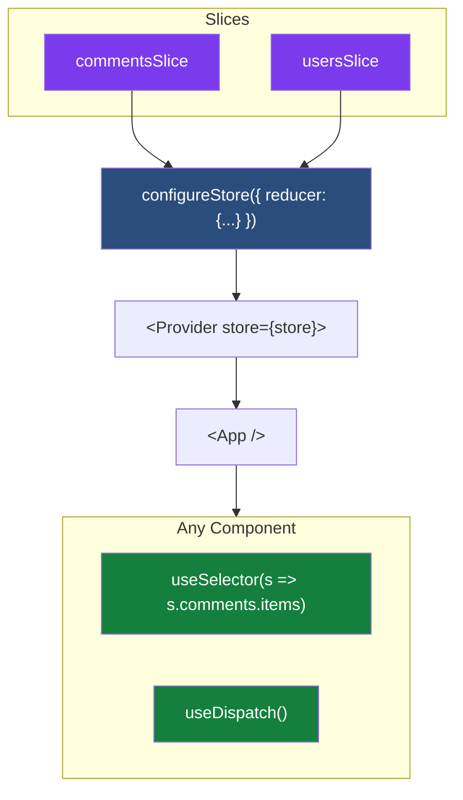

### Async work from a component

In practice, most components need to kick off async work as well: fetch data on mount, save on form submit, and so on. Dispatching a `createAsyncThunk`-based thunk from a component works identically to dispatching a synchronous action: call `dispatch(thunkName(args))`. The common pattern is firing the thunk from React's `useEffect` when the component appears:

```jsx
import { useEffect } from "react";
import { useDispatch, useSelector } from "react-redux";
import {
  fetchComments,
  addComment,
} from "./features/comments/commentsSlice";

function CommentsList() {
  const dispatch = useDispatch();
  const items = useSelector((state) => state.comments.items);
  const loading = useSelector((state) => state.comments.loading);
  const error = useSelector((state) => state.comments.error);

  // Fetch initial data once on mount.
  useEffect(() => {
    dispatch(fetchComments());
  }, [dispatch]);

  if (loading === "pending") return <p>Loading…</p>;
  if (error) return <p>Error: {error}</p>;

  return (
    <ul>
      {items.map((c) => <li key={c.id}>{c.text}</li>)}
      <button onClick={() => dispatch(addComment({ text: "New comment" }))}>
        Add
      </button>
    </ul>
  );
}
```

What happens on mount:

1. `dispatch(fetchComments())` runs. The thunk middleware intercepts it.
2. The thunk dispatches `fetchComments.pending` immediately. `state.comments.loading` becomes `"pending"`. `useSelector` notices the change, the component re-renders, the user sees "Loading…".
3. The API call resolves. The thunk dispatches `fetchComments.fulfilled` with the response as payload. `state.comments.items` is replaced with the new data.
4. `useSelector` notices again, the component re-renders, and the list appears.
5. If the API had failed instead, the thunk would dispatch `fetchComments.rejected` with the error. `state.comments.error` would be populated, and the component would render the error message.

The `dispatch` function returned by `useDispatch` is stable across renders (always the same function reference), so the `useEffect` dependency array does not change and the effect runs only once on mount. This is the standard pattern for "load this data when the component appears."

### The practical payoff of three actions

Notice how each of the three thunk actions maps directly to a UI branch in the code above:

| Thunk action | Slice updates | Component renders |
|---|---|---|
| `fetchComments.pending` | `state.comments.loading = "pending"` | `<p>Loading…</p>` |
| `fetchComments.rejected` | `state.comments.error = "..."` | `<p>Error: ...</p>` |
| `fetchComments.fulfilled` | `state.comments.items = [...]` | `<ul>...</ul>` |

This is the practical payoff of the three-action design. The component reads simple `loading` and `error` fields from state and renders one of three branches. No conditional logic inside a single "completed" handler. No payload inspection. The complexity of the async lifecycle stays inside the slice's `extraReducers`; the component stays clean.

If `createAsyncThunk` produced just one action, every component using async data would need to inspect the payload, check a status field, and branch on it inline. Three actions push that complexity into the slice once, and every consuming component benefits.

The complete React + Redux integration in one component: `useSelector` to read, `useDispatch` to write, `useEffect` to kick off side effects on mount.

### One important note on `useSelector`

`useSelector` re-renders the component when its return value changes, using reference equality (`===`).

```jsx
// GOOD: returns the same array reference if items haven't changed
const comments = useSelector((state) => state.comments.items);

// BAD: returns a NEW array every render, because .map() always creates a new array.
// This forces an unnecessary re-render on every dispatched action.
const commentTexts = useSelector((state) => state.comments.items.map((c) => c.text));
```

The fix: do not create new arrays or objects inside the selector function. Two options:

**Option 1: Select existing references.** Pick what is already in the state tree, don't transform it. Do the transformation in the component (where the cost is one render, not every render).

**Option 2: Use `createSelector` for memoized derived data.** `createSelector` is a function from the **Reselect** library. Reselect is a separate npm package that is re-exported by RTK, so you can import `createSelector` directly from `@reduxjs/toolkit` without installing anything extra. It builds a memoized selector: if the inputs (existing references in the state tree) have not changed, it returns the cached result instead of re-running the transformation.

```js
import { createSelector } from "@reduxjs/toolkit";

// Input selector: picks a stable reference from state.
const selectCommentItems = (state) => state.comments.items;

// Memoized selector: transforms items to texts only when items actually changes.
const selectCommentTexts = createSelector(
  [selectCommentItems],
  (items) => items.map((c) => c.text)
);

// In your component:
const commentTexts = useSelector(selectCommentTexts);
```

The transformation runs once on first call, and then only when `state.comments.items` becomes a new reference (i.e., when the slice actually changed). On subsequent renders, `useSelector` gets the same cached array, the `===` check passes, and the component does not re-render.

This is a production gotcha. Easy to write, easy to ship, hard to debug when your app re-renders unexpectedly.

---

## 18. The five-step setup

Putting everything together, the modern RTK + React pattern is five steps in this exact order:

1. **`createSlice`**: define the slice (name, initial state, reducers). Auto-generates action types and action creators.
2. **`configureStore`**: bundle slices into the store. Wires devtools, thunk middleware, and dev-mode checks automatically.
3. **`<Provider store={store}>`**: wrap your app at the root. Makes the store available to every component below.
4. **`useSelector`**: read from the store. Subscribes the component to a slice and re-renders when that slice changes.
5. **`useDispatch`**: fire actions. Returns the dispatch function, which you call with the action creators from your slice.

That is the entire integration. Everything else (`createAsyncThunk`, `extraReducers`, middleware) plugs into these five steps without changing the pattern.

---

## 19. Live demo

Switching to the React + Redux Toolkit project to see these five steps running.

Walking through:

- `src/features/comments/commentsSlice.js` with `createSlice` and `createAsyncThunk` (step 1)
- `src/store.js` with `configureStore` (step 2)
- `src/main.jsx` with `<Provider>` (step 3)
- `src/features/comments/CommentsList.jsx` with `useSelector` and `useDispatch` (steps 4 and 5)
- Redux DevTools showing the action log live

---

## 20. Where Redux fits in 2026

Modern React in 2026 has more tools. Server Components (the Next.js App Router model) handle a lot of what used to require Redux for server data. RTK Query is RTK's data-fetching companion if most of your state is server data.

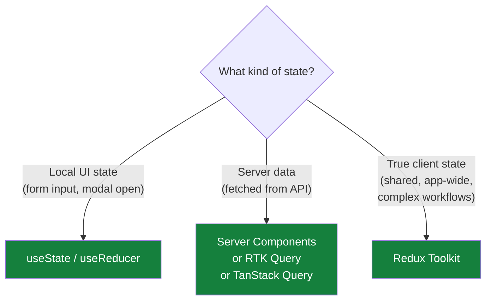

A quick note on `useReducer`. It is a React built-in hook (alongside `useState`) for local component state. It works like a miniature Redux pattern scoped to a single component: you provide a reducer function and an initial state, and it returns `[state, dispatch]`. Reach for it when local state involves several related fields or complex transitions that a single `useState` would make awkward. It is still local; Redux is what you use when the state needs to be shared across components.

Reach for Redux when state is shared across many distant components, when you need time-travel debugging or replay, or when you are modeling complex client workflows like multi-step forms or undo/redo.

Skip Redux when a `useState` would do, when the data lives on the server (use Server Components or a query library), or when React Context handles your scope cleanly.

---

## 21. Wrap-up

We covered:

- Why Redux exists, to escape prop drilling and re-render cascades in large component trees
- Core concepts: store (one per app, immutable state), actions, reducers
- Redux Toolkit: `configureStore`, `createSlice`, `createAsyncThunk` collapse the boilerplate
- Immer: RTK converts your mutable-looking code into immutable state updates under the hood
- React integration: `useDispatch` and `useSelector`, two hooks
- Where Redux fits in 2026: client state foundation, with Server Components and query libraries handling server data

Thank you.
