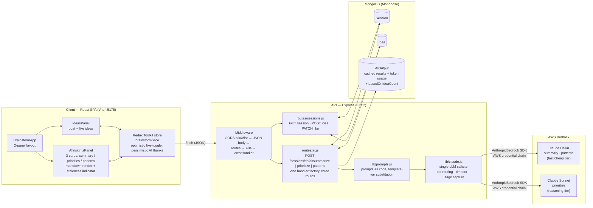
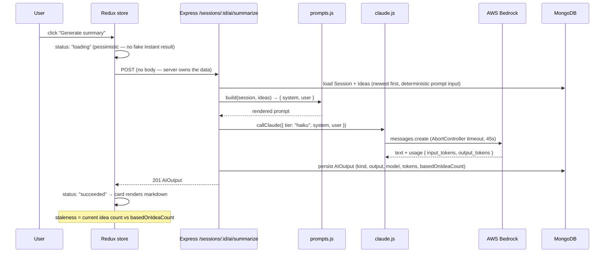
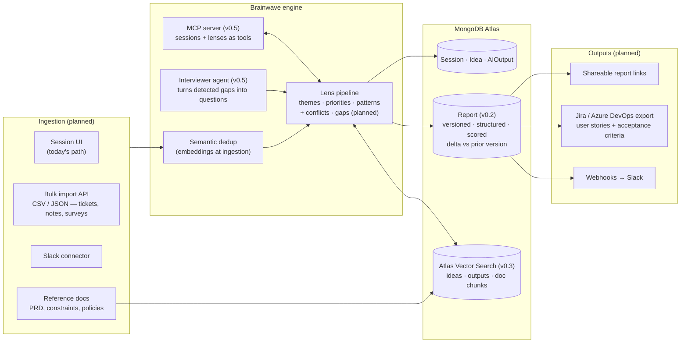

# Brainwave — Architecture

AI-augmented group brainstorming. Members post ideas into a shared session; on demand, Claude (via AWS Bedrock) summarizes the themes, ranks the top 5, and surfaces patterns in what the group gravitates toward.

This document is the architecture reference for the project: the system diagram, the request flow for an AI generation, the tech stack, and the decision matrix — every significant choice, the alternative it beat, and why. The code is the source of truth; each decision links to the file where it lives.

Sections 1–5 describe **what is built (v0.1)**. Section 7 describes **where it's heading** — the planned evolution toward the discovery-and-alignment product described in [product-vision.md](./product-vision.md). Planned decisions live in §7 and graduate into §5 when they ship.

---

## 1. System diagram

## 2. Request flow — one AI generation

Two properties of this flow worth naming:

- **The server owns the prompt input.** The client sends no idea text — the route reloads ideas from MongoDB at generation time. The client can't feed the model stale or tampered data, and the prompt input is reproducible.
- **Every generation is persisted, none is auto-served.** POST always regenerates; the cached output rides along on `GET /sessions/:id` for free. Cost control without staleness bugs — the user decides when to spend tokens, and `basedOnIdeaCount` tells them whether they should.

## 3. Tech stack

| Layer | Choice | Version |
|---|---|---|
| Frontend | React 18 + Vite 5 (SPA) | `react@18.3`, `vite@5.4` |
| Client state | Redux Toolkit + react-redux | `@reduxjs/toolkit@2.2` |
| Styling | Tailwind CSS + shadcn-style primitives (cva, clsx, tailwind-merge, lucide) | `tailwindcss@3.4` |
| Markdown render | react-markdown | `9.0` |
| Backend | Node 22 + Express 4 | `express@4.21` |
| ODM / DB | Mongoose 8 + MongoDB | `mongoose@8.7` |
| LLM access | AnthropicBedrock SDK → AWS Bedrock | `@anthropic-ai/bedrock-sdk@0.29` |
| Models | Claude Haiku 4.5 (fast tier) · Claude Sonnet 4.5 (reasoning tier) — env-overridable | `BEDROCK_MODEL_*` in `.env` |

## 4. Model routing

Model intensity matches work intensity — tier is chosen per operation, not globally:

| Operation | Endpoint | Tier | Why this tier |
|---|---|---|---|
| Summarize themes | `POST /sessions/:id/ai/summarize` | **Haiku** | Extraction + grouping over a small corpus; no multi-step reasoning |
| Extract patterns | `POST /sessions/:id/ai/patterns` | **Haiku** | Same shape as summary — classification work |
| Prioritize top 5 | `POST /sessions/:id/ai/prioritize` | **Sonnet** | Multi-criteria ranking (popularity × feasibility × diversity) with per-item rationale — genuine reasoning |

Model IDs are read from env (`BEDROCK_MODEL_HAIKU` / `BEDROCK_MODEL_SONNET`), so a different AWS account's Bedrock access — or a model upgrade — is a config change, not a code change. Token usage (input + output) is captured on every call and persisted on the `AIOutput` row, so per-operation cost is queryable from day one.

## 5. Decision matrix

Format follows the CSI reference-architecture discipline: the choice, the alternative it beat, and the one-line why. To challenge a row, read the linked code first.

### 5.1 Foundation

| # | Decision | Choice | Main alternative | Why | Where |
|---|---|---|---|---|---|
| F1 | App shape | Vite + React SPA + separate Express API | Next.js full-stack (RSC + Server Actions) | Heterogeneous-stack discipline: each app picks its right tool. Brainwave extends this repo's teaching lineage (`react-redux` → `express-comments-api` → here); the explicit client/server seam **is** the pedagogy | `package.json`, repo `README` |
| F2 | Database | MongoDB + Mongoose | Postgres (+ pgvector) | Document shape fits sessions/ideas/outputs; no relational joins or vector search in v0.1; schema-layer validation via Mongoose is the contract | `server/models/` |
| F3 | LLM access path | AWS Bedrock via AnthropicBedrock SDK | Direct Anthropic API; gateway (LiteLLM) | Enterprise credential story: AWS default credential chain (env / profile / IAM role), no API key handling in app code; gateway deferred until compliance demands it | `server/lib/claude.js` |
| F4 | Auth | None — trusted `member` name field | JWT / NextAuth / Clerk | v0.1 is a worked example, not a deployment; auth would obscure the AI-layer patterns the project exists to show. Flagged, not forgotten | `README` §deferred |

### 5.2 AI layer

| # | Decision | Choice | Main alternative | Why | Where |
|---|---|---|---|---|---|
| A1 | Model tiering | Haiku for summary/patterns, Sonnet for prioritize | One model for everything | Match model intensity to work intensity — ranking needs reasoning, extraction doesn't; ~80% of calls land on the cheap tier | `server/lib/claude.js` |
| A2 | Model selection mechanism | Env vars with code defaults | Hardcoded model IDs | Bedrock model access varies per AWS account; swapping models must not require a code edit | `server/lib/claude.js` (`MODELS`) |
| A3 | LLM callsite | Single wrapper function, one file | SDK calls inline in each route | One place for usage capture, provider swap, timeout, and the error shape — three routes, zero duplication | `server/lib/claude.js` (`callClaude`) |
| A4 | Prompt management | Prompts as code, in git | DB-stored prompts; managed tool (Langfuse, PromptLayer) | Diffable, PR-reviewable, co-located with the consuming code; managed tools earn their place only when A/B infrastructure justifies them | `server/lib/prompts.js` |
| A5 | Prompt templating | `{{var}}` substitution only | Handlebars / Jinja-style logic in templates | Logic in templates is logic you can't test; anything conditional moves into the prompt-builder functions | `server/lib/prompts.js` (`render`) |
| A6 | Output caching | Persist every result; never auto-serve from cache | TTL cache; serve-cached-unless-stale | Regeneration is an explicit user action; `basedOnIdeaCount` makes staleness visible instead of guessed. Semantic caching deferred | `server/routes/ai.js`, `server/models/AIOutput.js` |
| A7 | Cost observability | Token usage persisted per call | None; external dashboard only | `inputTokens`/`outputTokens` on every `AIOutput` row makes per-operation cost a Mongo query, not an AWS bill archaeology session | `server/models/AIOutput.js` |
| A8 | Timeout & failure shape | AbortController, 45s → 504; upstream errors → 502 | SDK default (can hang); generic 500s | The user's patience is the real timeout; distinct status codes separate "model slow" from "Bedrock rejected us" for diagnosis | `server/lib/claude.js` |
| A9 | Streaming | Deferred to a later version | Vercel AI SDK / raw SSE now | Outputs are short (≤2048 tokens); a clear loading state covers the latency; streaming adds a protocol layer v0.1 doesn't need yet | `README` §deferred |
| A10 | PII / redaction | None — flagged limitation | Redaction middleware before the LLM call | Synthetic demo data only; named explicitly as the first gate before any real-data deployment | `README` §deferred |

### 5.3 API & state

| # | Decision | Choice | Main alternative | Why | Where |
|---|---|---|---|---|---|
| S1 | Client state | Redux Toolkit (single store, one feature slice) | TanStack Query; Zustand; raw fetch | Deliberate continuity with this repo's Redux teaching thread; the AI thunks demonstrate async-state discipline that transfers to any state library | `client/src/store.js`, `brainstormSlice.js` |
| S2 | Mutation UX | Optimistic for likes, pessimistic for AI calls | One policy for all mutations | Likes are instant and reversible — optimistic with rollback; LLM calls take seconds and aren't predictable — honest loading state beats a fake instant result | `brainstormSlice.js` |
| S3 | AI route construction | One handler factory, three routes | Three hand-written handlers | All three operations share one shape (load → build prompt → call → persist); a fourth kind ("risks") is a one-line addition at both route and reducer (`addAiCases`) | `server/routes/ai.js`, `brainstormSlice.js` |
| S4 | Prompt input ordering | Ideas sorted newest-first at generation time | Insertion order; client-supplied | Deterministic prompt input — two runs against the same data see the same prompt, which is what makes runs comparable | `server/routes/ai.js` |
| S5 | Error contract | Single error shape from centralized handler | Per-route error formats | `{ error: { status, message } }` everywhere — the client writes one error path, not six | `server/middleware/errorHandler.js` |
| S6 | Staleness signaling | `basedOnIdeaCount` on each output | Stale flag maintained by writes; recompute hooks | Compare-at-read beats maintain-at-write: no flag to forget to update, and the UI can say *"from 8 ideas ago — regenerate?"* | `server/models/AIOutput.js` |

## 6. What this architecture is optimizing for

Brainwave is the public worked example of an AI-native delivery pattern: take a "wishlist" app — one that never made the business case before — and show that the AI layer is **ordinary engineering**: one callsite, prompts in git, explicit cost capture, honest caching, tiered models. Nothing in section 5.2 requires an ML team. That's the point.

The deliberate deviations from a greenfield-2026 default (SPA instead of Next.js, Redux instead of TanStack Query, Mongo instead of Postgres) are continuity decisions — this project extends the repo's teaching lineage rather than restarting it. A production fork would revisit F1, F2, and S1 first; the AI-layer decisions (A1–A10) transfer as-is.

## 7. Target state — planned evolution

The [product vision](./product-vision.md) takes Brainwave from "brainstorm + AI summary" to a discovery-and-alignment tool: multi-channel ingestion in, versioned diagnostic reports out. The capability roadmap (v0.2 → v0.5, one architectural concern per version) lives there; this section records the **architectural decisions already made for that trajectory**, so they get challenged before they get built.

### 7.1 Target system diagram (additions over §1)

### 7.2 Planned decisions (graduate to §5 when shipped)

| # | Decision | Choice | Main alternative | Why | Target |
|---|---|---|---|---|---|
| P1 | Report artifact | New `Report` collection above `AIOutput` — immutable versions, sections, score, delta, share token | Keep extending `AIOutput` | An AIOutput is one lens run; a report is a composed, versioned product artifact — different lifecycle, different consumer | v0.2 |
| P2 | Output contract | Structured JSON via tool-use schema; markdown rendered *from* structure | Freeform markdown (current) | You can diff, score, and dashboard JSON; you can't diff prose. Prerequisite for deltas and convergence scoring | v0.2 |
| P3 | Vector store | MongoDB Atlas Vector Search | Postgres + pgvector (second datastore) | Vector search where the data already lives; one database, one backup story. Revisit if retrieval needs outgrow it | v0.3 |
| P4 | Embedding access | Bedrock embedding models via `lib/embeddings.js` — same single-callsite discipline as `claude.js` | Direct OpenAI/Cohere APIs | Preserves the one-provider credential path (F3) and the one-callsite pattern (A3) | v0.2 |
| P5 | Dedup strategy | Embed at ingestion, flag near-duplicates for human merge | Auto-merge; exact-match only | Bulk import makes duplicates inevitable; auto-merge destroys signal (two people asking the same thing *is* signal) | v0.2 |
| P6 | Grounding & citations | Retrieved doc chunks injected with source IDs; lenses must cite | Ungrounded generation | A conflict or gap claim without a citation is an opinion; citations are what make the report defensible | v0.3 |
| P7 | Public API | Versioned `/v1`, API keys, rate limiting, OpenAPI spec | UI-only product | Headless "synthesis-as-a-service" is what lets other tools feed Brainwave; also the multi-tenancy forcing function | v0.4 |
| P8 | Integration surface | Slack in/out + Jira/Azure DevOps export first | Build many connectors early | Slack is where retros live; Jira export (stories + acceptance criteria) is what makes it a BA/PO daily tool. Everything else waits for pull | v0.4 |
| P9 | Agent surface | MCP server exposing sessions + lenses; interviewer agent built on it | Bespoke agent loop only | MCP makes Brainwave usable *by* any agent (Claude Code, etc.) for free; the interviewer agent is then just another MCP client | v0.5 |

The constraint that disciplines all of §7: **each addition must widen the gap between Brainwave and "a meeting with an AI summary"** (see product-vision.md — the differentiation list is the scope filter). Features that only polish the summary path don't ship.
